# Mailroom UI - Workflows Guide

> Your go-to guide when starting a new task. Be the team player, not just the intern! 🚀

---

## Table of Contents

1. [App Layout](#1-app-layout)
2. [Feature Workflow](#2-feature-workflow)
3. [Data Workflow](#3-data-workflow)
4. [Feature Folder Structure](#4-feature-folder-structure)
5. [Build New Feature](#5-build-new-feature)
6. [Fix a Bug](#6-fix-a-bug)
7. [Common Commands](#7-common-commands)

---

## 1. App Layout

### What You See On Screen:

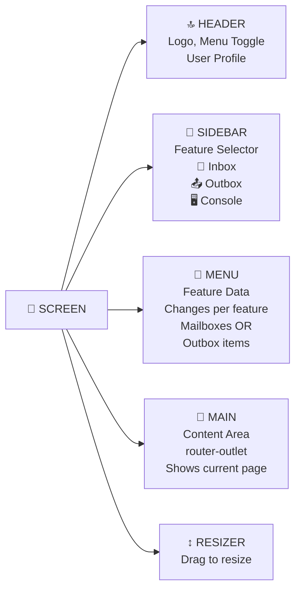

### Layout Stack:

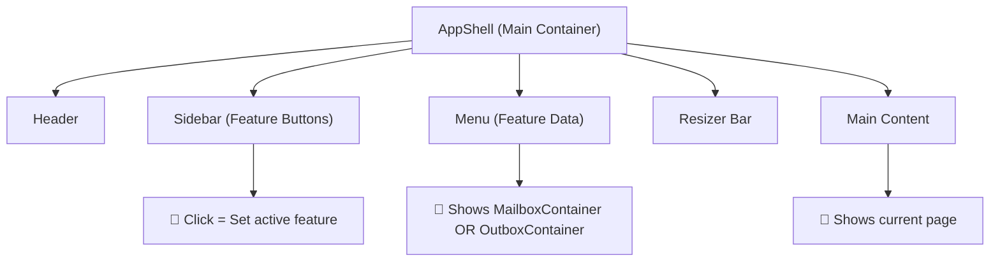

---

## 2. Feature Workflow

### User Clicks Feature in Sidebar:

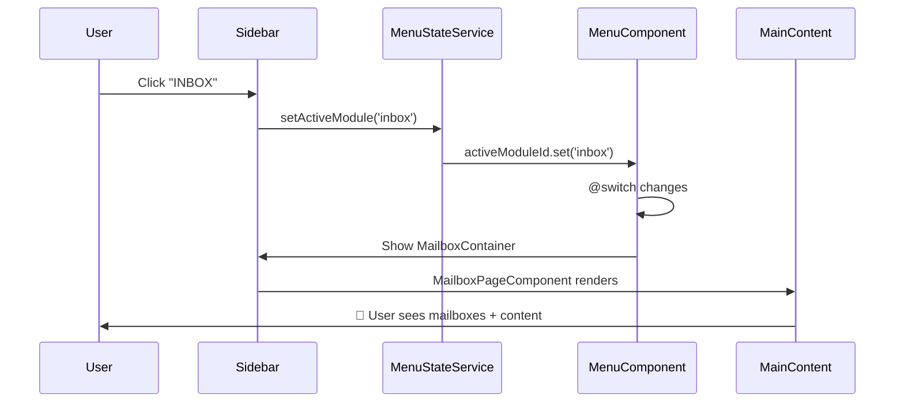

### Feature Selection Flow:

```mermaid
graph LR
    A["👆 User Click"] -->|Feature Button| B["🔔 MenuStateService"]
    B -->|activeModuleId changes| C["🎛️ Menu Component"]
    C -->|@switch case| D["📮 MailboxContainer<br/>OR<br/>📤 OutboxContainer<br/>OR<br/>🖥️ ConsoleContainer"]
    D -->|renders| E["📋 Feature List<br/>Shows data"]
```

### Menu @switch Logic:

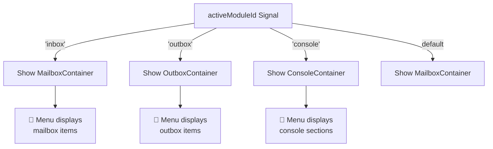

---

## 3. Data Workflow

### Complete User Action Flow:

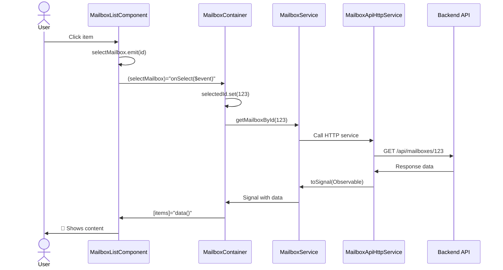

### Step by Step:

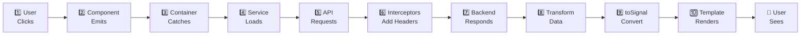

---

## 4. Feature Folder Structure

### Tree Structure:

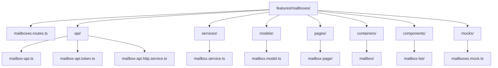

### Component Types:

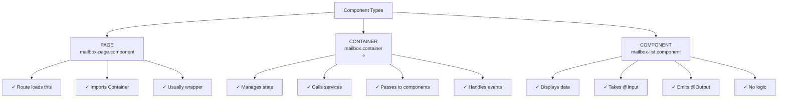

---

## 5. Build New Feature

### 11 Steps Process:

```mermaid
graph LR
    A["1. Folders"] --> B["2. Model"]
    B --> C["3. API Interface"]
    C --> D["4. API Token"]
    D --> E["5. HTTP Service"]
    E --> F["6. Feature Service"]
    F --> G["7. Container"]
    G --> H["8. Component"]
    H --> I["9. Page"]
    I --> J["10. Routes"]
    J --> K["11. DI Register"]
    
    K --> L["✅ Feature Ready"]
```

### Building Overview:

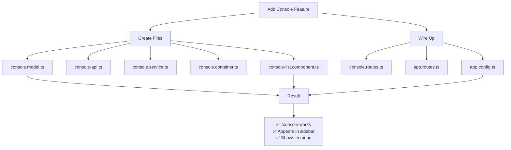

---

## 6. Fix a Bug

### Troubleshooting Flowchart:

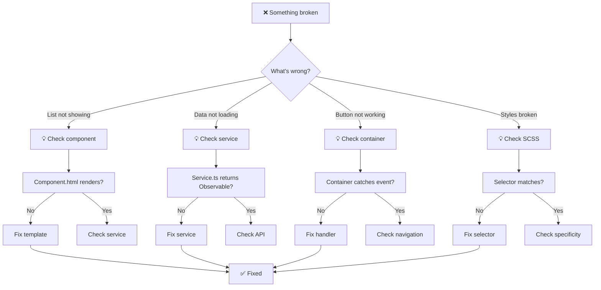

### Debug Checklist:

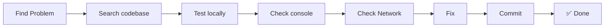

---

## 7. Common Commands

### Git Workflow:

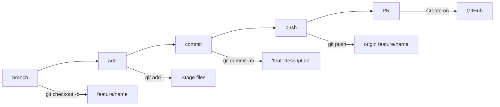

### Build & Test:

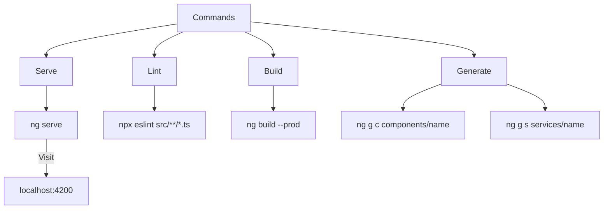

---

## Quick Tips

### Always Call Signals with ():

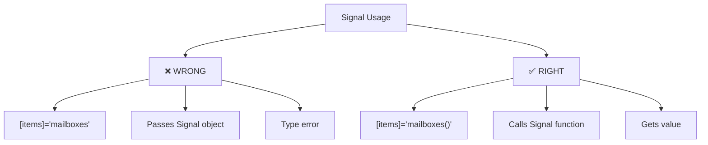

### Signal vs Observable:

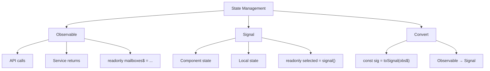

### Input/Output Flow:

```mermaid
graph LR
    A["Parent"] -->|[input]| B["Child"]
    B -->|@Input()| C["Receives value"]
    D["Child"] -->|emit()| E["Parent"]
    F["(output)"] -->|catches| G["Parent handler"]
```

---

## Be The Team Player 💪

### When Starting:

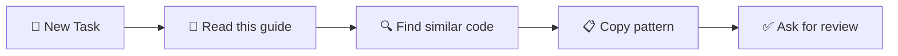

### When Finishing:

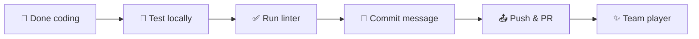

---

**Last Updated:** 2026-03-08  
**Remember:** Sidebar = Feature selector. Menu = Feature data. Always ask if stuck!


---

## 1. App Layout

### What you see on screen:

```
╔════════════════════════════════════════════╗
║  HEADER                                    ║  ← app-header
║  (Logo, Menu Toggle, User)                 ║
╠════════════════════════════════════════════╣
║ MENU      │ AppResizer │ MAIN CONTENT      ║
║           │ (drag me)  │                   ║
║ Mailboxes │ ███        │ Document List     ║
║ Outbox    │            │ or                ║
║           │            │ Another Feature   ║
║           │            │                   ║
║           │            │ (router-outlet)   ║
╠════════════════════════════════════════════╣
║  SIDEBAR (left)                            ║  ← app-sidebar
║  Tenant Selector                           ║
╚════════════════════════════════════════════╝
```

### The Code:

```
src/app/
├── app.component.html          ← Router outlet
├── core/
│   └── layout/
│       ├── app-shell/          ← Main layout wrapper
│       │   ├── app-shell.component.ts
│       │   ├── app-shell.component.html  (imports: header, sidebar, menu)
│       │   └── app-shell.component.scss
│       ├── header/             ← Top bar
│       ├── menu/               ← Left sidebar with containers
│       │   ├── menu.component.ts
│       │   ├── menu.component.html  (renders MailboxContainer/OutboxContainer)
│       │   ├── menu-state.service.ts  ← Controls collapsed/width state
│       │   └── menu.component.scss
│       └── sidebar/            ← Tenant selector
└── shared/
    └── ui/
        └── app-resizer/        ← Drag-to-resize bar
```

### How It Works:

1. **AppShell** renders the full layout
2. **Header** shows toggle button for menu
3. **Menu** contains MailboxContainer (shows mailbox list)
4. **AppResizer** sits between menu and main content (drag to resize)
5. **Main content** shows current page via router-outlet
6. **MenuStateService** manages: menu collapsed/open, menu width

### Touching the Layout:

| Want to... | Edit this file |
|-------|---|
| Change header buttons | `core/layout/header/header.component.ts` |
| Change menu appearance | `core/layout/menu/menu.component.html` |
| Add/remove menu items | `core/layout/menu/menu.component.ts` |
| Change menu colors | `core/layout/menu/menu.component.scss` |
| Change layout spacing | `shared/utils/layout-tokens.ts` |
| Change resizer behavior | `shared/ui/app-resizer/app-resizer.component.ts` |

---

## 2. Feature Folder Structure

### EVERY feature folder looks like this:

```
src/app/features/mailboxes/
│
├── mailboxes.routes.ts         ← URL routes for this feature
│
├── api/
│   ├── mailbox-api.ts          ← Interface (what methods exist)
│   ├── mailbox-api.token.ts    ← How to inject it
│   └── mailbox-api.http.service.ts ← Real HTTP code
│
├── services/
│   └── mailbox.service.ts      ← Business logic & data
│
├── models/
│   └── mailbox.model.ts        ← TypeScript types/interfaces
│
├── mocks/
│   └── mailboxes.mock.ts       ← Fake data for testing
│
├── pages/
│   └── mailbox-page/
│       ├── mailbox-page.component.ts    ← Entry point (route loads this)
│       ├── mailbox-page.component.html
│       └── mailbox-page.component.scss
│
├── containers/
│   └── mailbox/
│       ├── mailbox.container.ts         ← Smart (has state)
│       ├── mailbox.container.html
│       └── mailbox.container.scss
│
├── services/
│   └── mailbox.service.ts      ← API calls & transformation
│
└── components/
    ├── mailbox-list/           ← Dumb (just displays)
    └── document-list/
```

### Component Types (Pick the right one):

```
PAGE (mailbox-page.component.ts)
├─ Loaded by route
├─ Top level of feature
└─ Usually just contains a container

CONTAINER (mailbox.container.ts)
├─ Manages state (Signals)
├─ Calls services
├─ Passes data to components
└─ Handles user actions

COMPONENT (mailbox-list.component.ts)
├─ Displays data
├─ Takes @Input()
├─ Emits @Output()
└─ No business logic
```

---

## 3. How Data Flows

### Simple: User → UI → API → UI

```
1️⃣ USER ACTION
   User clicks "Select Mailbox"
        ▼
2️⃣ COMPONENT EMITS
   mailbox-list.component.ts:
   selectMailbox.emit(123)
        ▼
3️⃣ CONTAINER HANDLES
   mailbox.container.ts:
   onSelectMailbox(id) {
     this.selectedId.set(id)
     this.router.navigate(['/mailboxes', id])
   }
        ▼
4️⃣ SERVICE GETS DATA
   mailbox.service.ts:
   this.api.getMailboxById(123)
        ▼
5️⃣ HTTP HAPPENS
   mailbox-api.http.service.ts:
   this.http.get('/api/mailboxes/123')
        ▼
6️⃣ INTERCEPTORS ADD HEADERS
   - Authorization token
   - Tenant ID
   - Language
        ▼
7️⃣ BACKEND RESPONDS
   { id: 123, label: "Inbox", ... }
        ▼
8️⃣ SERVICE TRANSFORMS
   map(response => response.data)
   pipe(shareReplay(1))
        ▼
9️⃣ CONTAINER CONVERTS TO SIGNAL
   readonly mailbox = toSignal(service$, { initialValue: null })
        ▼
🔟 TEMPLATE RENDERS
   {{ mailbox().label }}
        ▼
👀 USER SEES RESULT
```

### Real Code Example:

**Step 1: Component emits**
```typescript
// components/mailbox-list/mailbox-list.component.ts
export class MailboxListComponent {
  selectMailbox = output<number>();  // ← Define output
  
  onSelect(mailbox: Mailbox) {
    this.selectMailbox.emit(mailbox.id);  // ← Emit event
  }
}

// Template
<app-ui-list (selectionChange)="onSelect($event)"></app-ui-list>
```

**Step 2: Container receives**
```typescript
// containers/mailbox/mailbox.container.ts
export class MailboxContainer {
  private service = inject(MailboxService);
  
  onSelectMailbox(id: number) {
    this.router.navigate(['/mailboxes', id]);
  }
}

// Template
<app-mailbox-list 
  (selectMailbox)="onSelectMailbox($event)">
</app-mailbox-list>
```

**Step 3: Service fetches**
```typescript
// services/mailbox.service.ts
@Injectable({ providedIn: 'root' })
export class MailboxService {
  private api = inject(MAILBOX_API);
  
  getMailbox(id: number) {
    return this.api.getMailboxById(id);  // ← API call
  }
}
```

**Step 4: API service makes HTTP**
```typescript
// api/mailbox-api.http.service.ts
@Injectable()
export class MailboxApiHttpService implements MailboxApi {
  private http = inject(HttpClient);
  
  getMailboxById(id: number): Observable<Mailbox> {
    return this.http.get(`/api/mailboxes/${id}`);
  }
}
```

---

## 4. Task: Build New Feature

### Step 1: Create folders
```bash
mkdir -p src/app/features/console/{api,services,models,mocks,pages,containers,components/console-list}
```

### Step 2: Define your types

**models/console.model.ts**
```typescript
export interface ConsoleSection {
  id: string;
  label: string;
  description?: string;
}
```

### Step 3: Create API interface

**api/console-api.ts**
```typescript
export interface ConsoleApi {
  getSections(): Observable<ConsoleSection[]>;
}
```

### Step 4: Create API token

**api/console-api.token.ts**
```typescript
import { InjectionToken } from '@angular/core';
import { ConsoleApi } from './console-api';

export const CONSOLE_API = new InjectionToken<ConsoleApi>('CONSOLE_API');
```

### Step 5: Implement HTTP service

**api/console-api.http.service.ts**
```typescript
@Injectable()
export class ConsoleApiHttpService implements ConsoleApi {
  private http = inject(HttpClient);
  private config = inject(AppConfigService);

  getSections(): Observable<ConsoleSection[]> {
    return this.http
      .get<{ data: ConsoleSection[] }>(
        `${this.config.appConfig.apiBaseUrl}/console`
      )
      .pipe(map(res => res.data ?? []));
  }
}
```

### Step 6: Create service

**services/console.service.ts**
```typescript
@Injectable({ providedIn: 'root' })
export class ConsoleService {
  private api = inject(CONSOLE_API);

  readonly sections$ = this.api.getSections().pipe(shareReplay(1));
}
```

### Step 7: Create container

**containers/console/console.container.ts**
```typescript
@Component({
  selector: 'app-console-container',
  standalone: true,
  imports: [CommonModule, ConsoleListComponent],
  template: `
    <app-console-list 
      [sections]="sections()"
      (selectSection)="onSelect($event)">
    </app-console-list>
  `,
})
export class ConsoleContainer {
  private service = inject(ConsoleService);
  
  readonly sections = toSignal(this.service.sections$, { 
    initialValue: [] 
  });

  onSelect(id: string) {
    console.log('Selected:', id);
  }
}
```

### Step 8: Create list component

**components/console-list/console-list.component.ts**
```typescript
@Component({
  selector: 'app-console-list',
  standalone: true,
  imports: [CommonModule, UiListComponent],
  template: `
    <app-ui-list
      [items]="sections()"
      (selectionChange)="onSelect($event)">
      <ng-template #itemTemplate let-item>
        <div>{{ item.label }}</div>
      </ng-template>
    </app-ui-list>
  `,
})
export class ConsoleListComponent {
  sections = input.required<ConsoleSection[]>();
  selectSection = output<string>();

  onSelect(items: ConsoleSection[]) {
    this.selectSection.emit(items[0].id);
  }
}
```

### Step 9: Create page

**pages/console-page/console-page.component.ts**
```typescript
@Component({
  selector: 'app-console-page',
  standalone: true,
  imports: [ConsoleContainer],
  template: `<app-console-container></app-console-container>`,
})
export class ConsolePageComponent {}
```

### Step 10: Register routes

**console.routes.ts**
```typescript
import { Routes } from '@angular/router';
import { ConsolePageComponent } from './pages/console-page/console-page.component';

export const CONSOLE_ROUTES: Routes = [
  { path: '', component: ConsolePageComponent }
];
```

**Update app.routes.ts:**
```typescript
import { CONSOLE_ROUTES } from './features/console/console.routes';

export const routes: Routes = [
  // ... other routes
  { path: 'console', children: CONSOLE_ROUTES }
];
```

### Step 11: Register in DI

**app.config.ts**
```typescript
import { CONSOLE_API } from './features/console/api/console-api.token';
import { ConsoleApiHttpService } from './features/console/api/console-api.http.service';

export const appConfig: ApplicationConfig = {
  providers: [
    // ... other providers
    { provide: CONSOLE_API, useClass: ConsoleApiHttpService }
  ]
};
```

### ✅ DONE! Feature works. Test it at `/console`

---

## 5. Task: Fix a Bug

### Example: "List items not showing in mailbox"

1. **Identify the file:**
   - A list displays → Component file
   - Data not loading → Service file
   - Wrong data → API/Model file

2. **For **display issue** → Check component:**
   ```
   src/app/features/mailboxes/components/mailbox-list/
   ├── mailbox-list.component.ts
   ├── mailbox-list.component.html
   └── mailbox-list.component.scss
   ```

3. **For **data issue** → Check service:**
   ```
   src/app/features/mailboxes/services/mailbox.service.ts
   ```

4. **For **API issue** → Check HTTP:**
   ```
   src/app/features/mailboxes/api/mailbox-api.http.service.ts
   ```

5. **Search for clues:**
   ```bash
   # Search in component files
   grep -r "mailbox-list" src/app/features/mailboxes/components/
   
   # Search in service
   grep -r "getMailboxes" src/app/features/mailboxes/
   ```

6. **Test locally:**
   ```bash
   ng serve
   # Open browser, check console for errors
   ```

7. **Commit:**
   ```bash
   git add .
   git commit -m "fix: mailbox list items not showing"
   git push origin <your-branch>
   ```

---

## 6. Task: Add New Field

### Example: "Add 'description' field to mailbox display"

### Step 1: Update model
```typescript
// models/mailbox.model.ts
export interface Mailbox {
  id: number;
  label: string;
  description: string;  // ← NEW FIELD
  unreadCount: number;
}
```

### Step 2: Update component template
```html
<!-- components/mailbox-list/mailbox-list.component.html -->
<ng-template #itemTemplate let-item>
  <div>
    {{ item.label }}
    <small>{{ item.description }}</small>  ← NEW
  </div>
</ng-template>
```

### Step 3: Add styling if needed
```scss
// components/mailbox-list/mailbox-list.component.scss
small {
  display: block;
  color: #999;
  font-size: 12px;
}
```

### Step 4: Test
- Open browser
- Check if description shows
- If not, check API returns this field

### Step 5: If API doesn't have it
Update API service to map it:
```typescript
// api/mailbox-api.http.service.ts
.pipe(
  map(response => response.data?.map(m => ({
    ...m,
    description: m.desc || 'No description'  // Map from API
  })) ?? [])
)
```

---

## 7. Common Commands

### Serve locally
```bash
ng serve
# Visit: http://localhost:4200
```

### Build for production
```bash
ng build --prod
```

### Run linter
```bash
npx eslint src/**/*.ts src/**/*.html
```

### Generate report
```bash
npx eslint src/**/*.ts src/**/*.html -f html -o report.html
```

### Git workflow
```bash
# Create branch
git checkout -b feature/my-feature

# Stage changes
git add .

# Commit
git commit -m "feat: add new feature"

# Push
git push origin feature/my-feature

# Create PR on GitHub
```

### Generate component
```bash
ng g c features/mailboxes/components/my-new-component
```

### Generate service
```bash
ng g s features/mailboxes/services/my-new-service
```

---

## Quick Tips

### 🔴 Remember: Always call Signals with `()`

```html
<!-- ❌ WRONG -->
[items]="mailboxes"

<!-- ✅ RIGHT -->
[items]="mailboxes()"
```

### 🔴 Signal vs Observable

```typescript
// Observable - for API calls
readonly mailboxes$ = this.api.getMailboxes();

// Signal - for component state
readonly selected = signal<Mailbox | null>(null);

// Convert Observable to Signal
readonly mailboxes = toSignal(this.mailboxes$, { initialValue: [] });
```

### 🔴 Input/Output Pattern

```typescript
// Parent passes data
[items]="myItems()"

// Child receives
items = input.required<Item[]>();

// Child emits event
selectItem = output<Item>();

// Child sends
this.selectItem.emit(item);

// Parent listens
(selectItem)="handler($event)"
```

---

## File Locations You'll Use

| Task | File |
|------|------|
| Change what displays | `components/.../...component.html` |
| Change how it looks | `components/.../...component.scss` |
| Add display logic | `components/.../...component.ts` |
| Change business logic | `services/.../service.ts` |
| Change API endpoint | `api/.../api.http.service.ts` |
| Add new data type | `models/.../model.ts` |
| Change global layout | `core/layout/app-shell/` |
| Change menu items | `core/layout/menu/` |
| Change spacing/colors | `shared/utils/layout-tokens.ts` |
| Add new route | `features/.../...routes.ts` |
| Register new service | `app.config.ts` |

---

## When Stuck

### "Where do I put this code?"
→ Follow the folder structure → Find similar code → Copy pattern

### "Why isn't my component showing?"
→ Is it imported in parent? → Is the route defined? → Check browser console

### "Data not loading?"
→ Check API response in Network tab → Check service returns Observable → Check container converts to Signal

### "Styling not working?"
→ Check selector name matches HTML → Check CSS specificity → Try without `!important` first

---

## Be The Team Player 💪

**When you start:**
1. Read this guide
2. Find similar code
3. Copy the pattern
4. Ask for review

**When you finish:**
1. Test locally
2. Check eslint: `npx eslint src/**/*.{ts,html}`
3. Commit with clear message
4. Push to your branch
5. Create PR with description

**That's it. You're now a productive team member!** 🚀

---

**Last Updated:** 2026-03-08  
**For Questions:** Read this again, then ask seniors
