# Mailroom UI - Architecture & Workflows Guide

> **Frontend Architecture Document** - A comprehensive guide to understanding the application structure, data flow patterns, and development workflows.

---

## Table of Contents

1. [Application Layers](#1-application-layers)
2. [Core Architecture](#2-core-architecture)
3. [Feature Module Pattern](#3-feature-module-pattern)
4. [Data Flow Architecture](#4-data-flow-architecture)
5. [Component Architecture](#5-component-architecture)
6. [Routing Architecture](#6-routing-architecture)
7. [State Management](#7-state-management)
8. [Service Patterns](#8-service-patterns)
9. [Shared UI Components](#9-shared-ui-components)
10. [Feature Workflows](#10-feature-workflows)

---

## 1. Application Layers

The application is organized in **4 distinct layers** following a clean architecture approach:

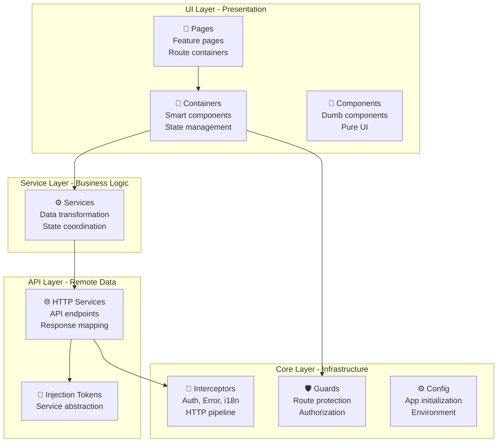

### Layer Responsibilities

| Layer | Responsibility | Examples |
|-------|---|---|
| **UI** | Render UI, emit events | Pages, Containers, Components |
| **Service** | Business logic, data transformation | MailboxService, DocumentService |
| **API** | HTTP communication, response mapping | MailboxApiHttpService |
| **Core** | Cross-cutting concerns | Auth, Error handling, Config |

---

## 2. Core Architecture

### 2.1 Application Bootstrap

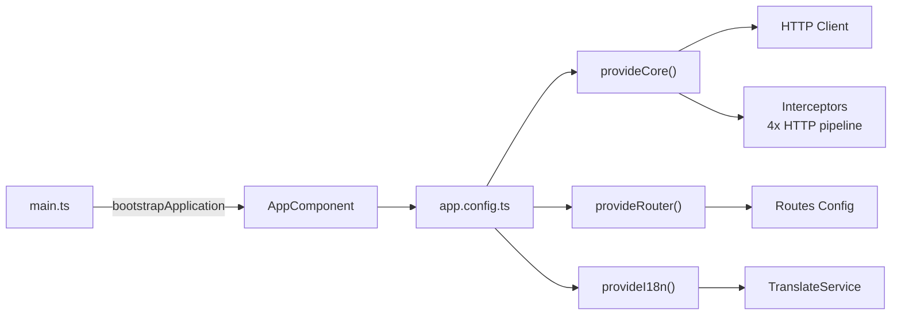

### 2.2 Dependency Injection Container

```typescript
// app.config.ts - Central DI configuration
export const appConfig: ApplicationConfig = {
  providers: [
    provideCore(),           // HTTP, Interceptors, Auth
    provideI18n(),          // Translation service
    provideAppConfig(),     // Config initialization
    provideRouter(routes),  // Routing
    
    // API Implementations (Injection Tokens)
    { provide: MAILBOX_API, useClass: MailboxApiHttpService },
    { provide: DOCUMENT_API, useClass: DocumentApiHttpService },
    { provide: VIEWER_API, useClass: ViewerApiHttpService },
    { provide: BUNDLE_API, useClass: BundleApiHttpService },
  ]
};
```

### 2.3 HTTP Interceptor Pipeline

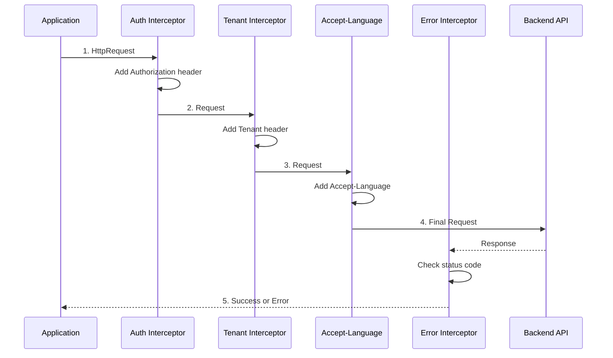

---

## 3. Feature Module Pattern

### 3.1 Feature Folder Structure

Every feature follows this **consistent structure**:

```
features/
├── mailboxes/                    # Feature module name
│   ├── mailboxes.routes.ts      # Route definitions
│   ├── api/
│   │   ├── mailbox-api.ts       # Interface (abstraction)
│   │   ├── mailbox-api.token.ts # Injection token
│   │   └── mailbox-api.http.service.ts  # Implementation
│   ├── services/
│   │   └── mailbox.service.ts   # Business logic
│   ├── models/
│   │   └── mailbox.model.ts     # TypeScript interfaces
│   ├── mocks/
│   │   └── mailboxes.mock.ts    # Dev/test data
│   ├── pages/
│   │   └── mailbox-page/
│   │       ├── mailbox-page.component.ts
│   │       ├── mailbox-page.component.html
│   │       └── mailbox-page.component.scss
│   ├── containers/
│   │   └── mailbox/
│   │       ├── mailbox.container.ts    # Smart component
│   │       ├── mailbox.container.html
│   │       └── mailbox.container.scss
│   └── components/
│       ├── mailbox-list/
│       └── document-list/
```

### 3.2 Feature Module Layers (Detailed)

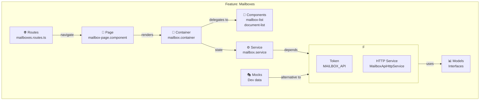

---

## 4. Data Flow Architecture

### 4.1 Master Data Flow (Request → Response)

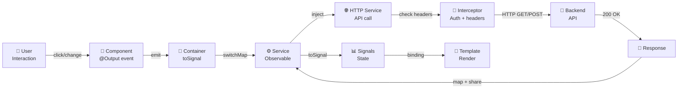

### 4.2 Real-world Example: Load Mailboxes

```typescript
// Step 1: User navigates to /mailboxes
// ↓
// Step 2: Resolver triggers mailboxResolver
// ↓
// Step 3: MailboxService initiates request
readonly mailboxes$ = this.refresh$.pipe(
  startWith(void 0),                    // Trigger immediately
  switchMap(() => this.api.getMailboxes()),  // Call API
  shareReplay(1)                        // Share result, cache
);

// Step 4: Container converts to Signal
readonly mailboxes = toSignal(
  this.mailboxService.mailboxes$.pipe(map(...)),
  { initialValue: [] }
);

// Step 5: Transform data (add avatars, initials)
map(sections => sections.map(section => ({
  ...section,
  mailboxes: section.mailboxes.map(m => ({
    ...m,
    initials: this.avatarUtils.getInitials(m.label),
    avatarClass: this.avatarUtils.getAvatarClass(m.label)
  }))
})))

// Step 6: Pass to component as input Signal
[sections]="mailboxes()"    // Call signal to get value

// Step 7: Component renders with UiListComponent
<app-ui-list [items]="sections()" (selectionChange)="onSelectionChange($event)">
```

---

## 5. Component Architecture

### 5.1 Component Type Hierarchy

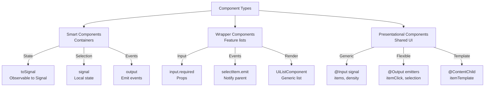

### 5.2 Input/Output Pattern (Modern)

```typescript
// ✅ NEW: Signals API (Angular 17+)
@Component({...})
export class MailboxListComponent {
  // Input as Signal
  mailboxes = input.required<Mailbox[]>();
  selectedMailboxId = input<number | null>(null);
  
  // Computed derived state
  selectedMailbox = computed(() => {
    const id = this.selectedMailboxId();
    if (!id) return null;
    return this.mailboxes()?.find(m => m.id === id) ?? null;
  });
  
  // Output for events
  selectMailbox = output<number>();
  
  onSelectionChange(items: Mailbox[]) {
    this.selectMailbox.emit(items[0].id);
  }
}

// Template usage
[mailboxes]="mailboxes()"           // ✅ Call signal
[selectedMailboxId]="selectedId()"  // ✅ Call signal
(selectMailbox)="onSelect($event)"  // ✅ Event listener
```

### 5.3 Generic Reusable Component: UiListComponent

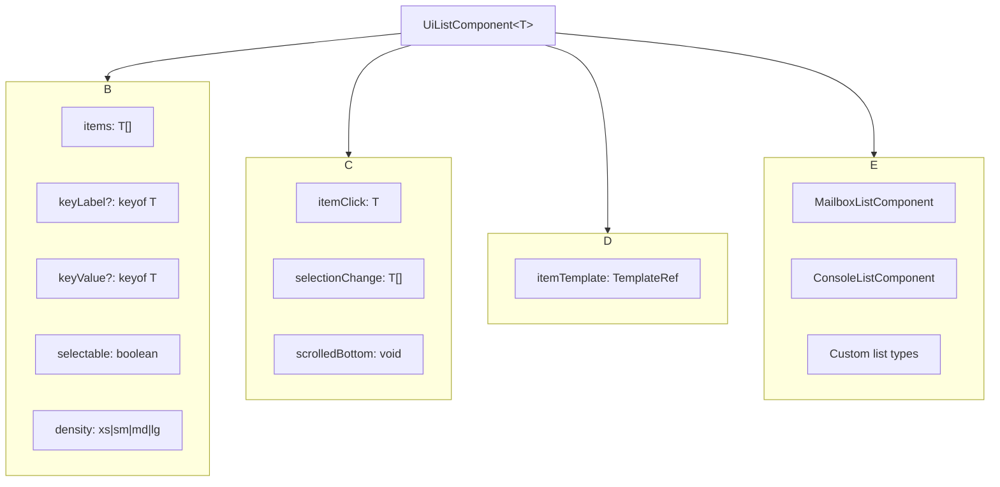

---

## 6. Routing Architecture

### 6.1 Route Hierarchy

```
/
├── /select-tenant              ← Tenant selection
├── /                           ← Home (canActivate: tenantGuard)
│   ├── /mailboxes              ← Mailbox list
│   ├── /mailboxes/:id          ← Specific mailbox
│   ├── /outbox                 ← Outbox feature
│   └── /console                ← Console feature
└── /tenant-selector            ← Admin tenant selector
```

### 6.2 Route Resolution & Guards

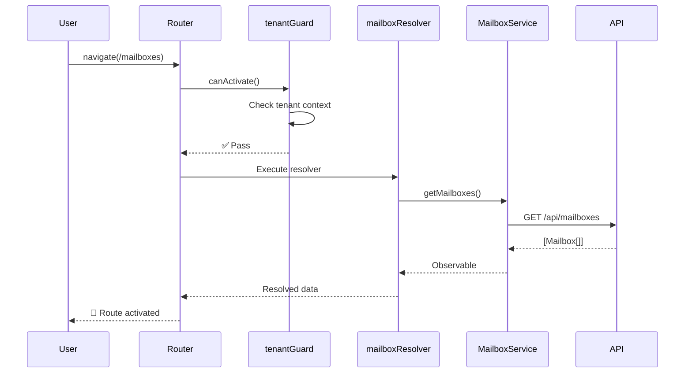

### 6.3 Lazy Load with MAILBOX_ROUTES

```typescript
// app.routes.ts - Main router configuration
export const routes: Routes = [
  {
    path: 'mailboxes',
    component: MailboxPageComponent,
    resolve: { mailboxes: mailboxResolver },  // Pre-load data
  },
  {
    path: 'mailboxes/:mailboxId',
    component: MailboxPageComponent,
    resolve: { mailboxes: mailboxResolver },
  },
];

// mailboxes.routes.ts - Feature routes
export const MAILBOX_ROUTES: Routes = [
  {
    path: '',
    pathMatch: 'full',
    redirectTo: 'mailboxes',
  },
  ...
];
```

---

## 7. State Management

### 7.1 State Management Strategy

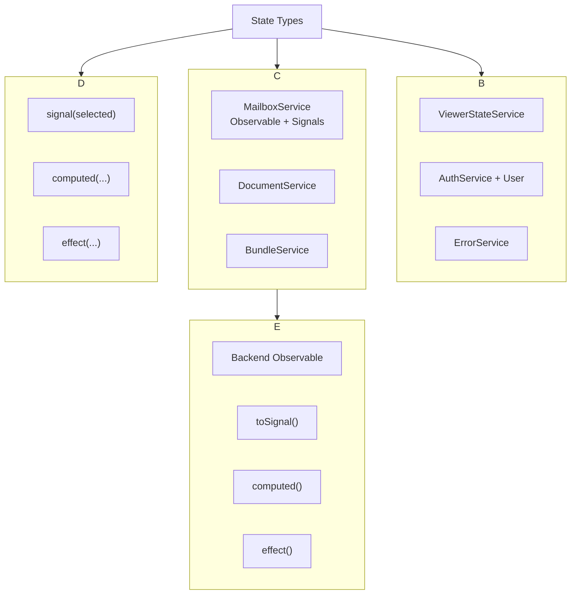

### 7.2 Signal-based State (Modern Example)

```typescript
// MailboxService - Feature state management
@Injectable({ providedIn: 'root' })
export class MailboxService {
  private readonly api = inject(MAILBOX_API);
  
  // Signals for state
  private readonly searchQuerySignal = signal('');
  private readonly hasMoreSearchResultsSignal = signal(true);
  readonly loading = signal(true);
  
  // Subjects for actions
  private readonly refresh$ = new Subject<void>();
  private readonly searchInput$ = new Subject<MailboxSearch>();
  
  // Observable state (from API)
  readonly mailboxes$ = this.refresh$.pipe(
    startWith(void 0),
    switchMap(() => this.api.getMailboxes()),
    shareReplay(1)  // Cache result
  );
  
  // Derived signals
  readonly hasSearchResults = computed(() => 
    this.searchQuerySignal().length > 0
  );
}

// Container - Convert Observable to Signal
export class MailboxContainer {
  readonly mailboxes = toSignal(
    this.mailboxService.mailboxes$.pipe(map(...)),
    { initialValue: [] }
  );
  
  readonly selectedMailboxId = signal<number | null>(null);
  
  selectMailbox(id: number) {
    this.selectedMailboxId.set(id);
  }
}
```

### 7.3 When to Use Signal vs Observable

| Use Case | Pattern | Example |
|----------|---------|---------|
| **Local state** | `signal()` | `selectedId = signal(null)` |
| **Derived state** | `computed()` | `computed(selectedMailbox)` |
| **Effect** | `effect()` | `effect(() => router.navigate(...))` |
| **API response** | `Observable` | `this.api.getMailboxes()` |
| **Convert to signal** | `toSignal()` | `toSignal(observable$)` |
| **Subscription cleanup** | `takeUntilDestroyed()` | Automatic cleanup |

---

## 8. Service Patterns

### 8.1 API Service Pattern (Token + Implementation)

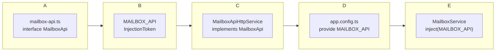

```typescript
// 1️⃣ Abstraction - mailbox-api.ts
export interface MailboxApi {
  getMailboxes(): Observable<MailboxSection[]>;
  getMailboxById(id: number): Observable<Mailbox>;
  searchMailbox(query: string): Observable<MailboxSearch[]>;
}

// 2️⃣ Token - mailbox-api.token.ts
export const MAILBOX_API = new InjectionToken<MailboxApi>('MAILBOX_API');

// 3️⃣ Implementation - mailbox-api.http.service.ts
@Injectable()
export class MailboxApiHttpService implements MailboxApi {
  private readonly http = inject(HttpClient);
  private readonly config = inject(AppConfigService);
  
  getMailboxes(): Observable<MailboxSection[]> {
    return this.http
      .get<MailboxResponse>(`${this.config.appConfig.apiBaseUrl}/mailboxes`)
      .pipe(map(res => res.data ?? []));
  }
}

// 4️⃣ Registration - app.config.ts
{ provide: MAILBOX_API, useClass: MailboxApiHttpService }

// 5️⃣ Usage - mailbox.service.ts
export class MailboxService {
  private readonly api = inject(MAILBOX_API);  // Get from DI
  
  readonly mailboxes$ = this.api.getMailboxes();
}
```

### 8.2 Service Responsibilities

```
MailboxService (⚙️ Business Logic)
├── Coordinate API calls
├── Manage feature state (Signals + Observables)
├── Transform data
├── Handle search/pagination
└── Expose Observables for components

MailboxApiHttpService (🌐 HTTP)
├── Make HTTP requests
├── Map API responses
├── Apply HttpParams
└── Handle URL building

MailboxContainer (🎯 Smart Component)
├── Subscribe to service
├── Convert Observable → Signal
├── Handle user interactions
└── Navigate/update URL
```

---

## 9. Shared UI Components

### 9.1 Component Library Architecture

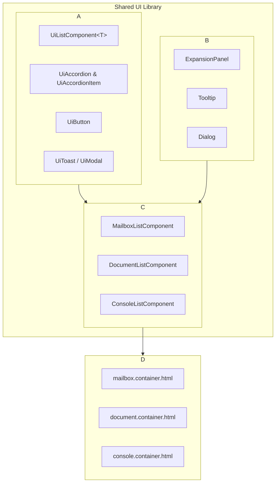

### 9.2 Generic List Pattern

**UiListComponent** is the **core reusable component** for all list rendering:

```typescript
// Generic signature
@Component({...})
export class UiListComponent<T> {
  items = input.required<T[]>();
  keyLabel = input<keyof T | null>(null);      // Which field to display
  keyValue = input<keyof T | null>(null);      // Unique identifier
  selectable = input(false);                    // Enable selection
  multiSelect = input(false);                   // Multiple selection
  
  itemClick = output<T>();
  selectionChange = output<T[]>();
  scrolledBottom = output<void>();
  
  itemTemplate = contentChild(...);             // Custom render template
}
```

**Feature-specific wrappers** adapt UiListComponent:

```typescript
// MailboxListComponent - Wraps UiListComponent for mailboxes
@Component({
  selector: 'app-mailbox-list',
  template: `
    <app-ui-list
      [items]="mailboxes()"
      [selectedItem]="selectedMailbox()"
      (selectionChange)="onSelectionChange($event)">
      <ng-template #itemTemplate let-mailbox>
        <div>{{ mailbox.label }}</div>
        <span class="unread">{{ getUnreadLabel(mailbox.unreadCount) }}</span>
      </ng-template>
    </app-ui-list>
  `
})
export class MailboxListComponent {
  mailboxes = input.required<Mailbox[]>();
  selectMailbox = output<number>();
  
  onSelectionChange(items: Mailbox[]) {
    this.selectMailbox.emit(items[0].id);
  }
}
```

---

## 10. Feature Workflows

### 10.1 Complete Feature Workflow: Load & Display Mailboxes

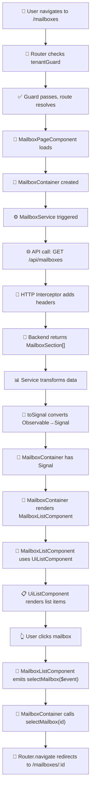

### 10.2 Accordion Component Workflow (Single Mode)

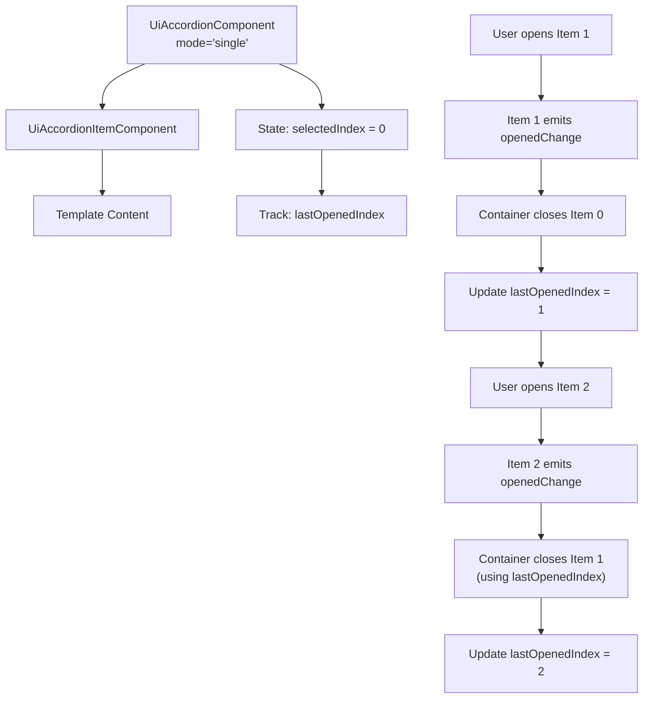

### 10.3 Document Viewing Workflow

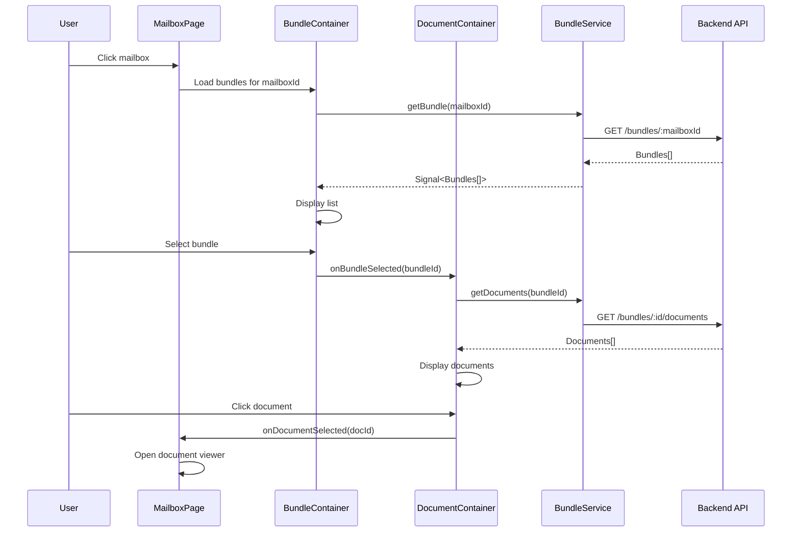

---

## 11. Development Workflow Best Practices

### 11.1 Creating a New Feature

#### Step 1: Setup Feature Structure
```bash
features/myfeature/
├── myfeature.routes.ts
├── api/
│   ├── myfeature-api.ts           # Interface
│   ├── myfeature-api.token.ts     # Token
│   └── myfeature-api.http.service.ts  # Implementation
├── services/
│   └── myfeature.service.ts       # Business logic
├── models/
│   └── myfeature.model.ts
├── pages/
│   └── myfeature-page/
├── containers/
│   └── myfeature/
└── components/
    └── myfeature-list/
```

#### Step 2: Define API Contract

```typescript
// myfeature-api.ts (Abstraction)
export interface MyFeatureApi {
  getItems(): Observable<MyFeatureItem[]>;
  getItem(id: string): Observable<MyFeatureItem>;
}
```

#### Step 3: Implement API Service

```typescript
// myfeature-api.http.service.ts
@Injectable()
export class MyFeatureApiHttpService implements MyFeatureApi {
  private readonly http = inject(HttpClient);
  private readonly config = inject(AppConfigService);

  getItems(): Observable<MyFeatureItem[]> {
    return this.http
      .get<ApiResponse<MyFeatureItem[]>>(
        `${this.config.appConfig.apiBaseUrl}/items`
      )
      .pipe(map(res => res.data ?? []));
  }
}
```

#### Step 4: Create Feature Service

```typescript
// myfeature.service.ts
@Injectable({ providedIn: 'root' })
export class MyFeatureService {
  private readonly api = inject(MYFEATURE_API);
  
  readonly items$ = this.api.getItems().pipe(shareReplay(1));
}
```

#### Step 5: Create Container Component

```typescript
// containers/myfeature/myfeature.container.ts
@Component({
  selector: 'app-myfeature-container',
  template: `<app-myfeature-list [items]="items()"></app-myfeature-list>`,
  standalone: true,
  imports: [CommonModule, MyFeatureListComponent],
})
export class MyFeatureContainer {
  private readonly service = inject(MyFeatureService);
  
  readonly items = toSignal(this.service.items$, { initialValue: [] });
}
```

#### Step 6: Create Feature List Component

```typescript
// components/myfeature-list/myfeature-list.component.ts
@Component({
  selector: 'app-myfeature-list',
  template: `
    <app-ui-list [items]="items()" (selectionChange)="onSelect($event)">
      <ng-template #itemTemplate let-item>
        <!-- Custom render -->
      </ng-template>
    </app-ui-list>
  `,
  standalone: true,
})
export class MyFeatureListComponent {
  items = input.required<MyFeatureItem[]>();
  selectItem = output<MyFeatureItem>();
  
  onSelect(items: MyFeatureItem[]) {
    this.selectItem.emit(items[0]);
  }
}
```

#### Step 7: Register Routes & DI

```typescript
// app.routes.ts
{ path: 'myfeature', component: MyFeaturePageComponent }

// app.config.ts
{ provide: MYFEATURE_API, useClass: MyFeatureApiHttpService }
```

### 11.2 Common Gotchas

| Problem | Solution |
|---------|----------|
| **Signal not updating in template** | Call signal with `()`: `[items]="items()"` |
| **Can't style template in container** | Add `ViewEncapsulation.None` to component |
| **Memory leaks from subscriptions** | Use `takeUntilDestroyed()` or `toSignal()` |
| **Type errors with computed/input** | Always invoke with `()` in template |
| **Form not resetting** | Use `markAllAsTouched()` and proper Signal updates |
| **Accordion single mode closing multiple** | Track `lastOpenedIndex` and only close that one |

---

## 12. Workflow Decision Tree

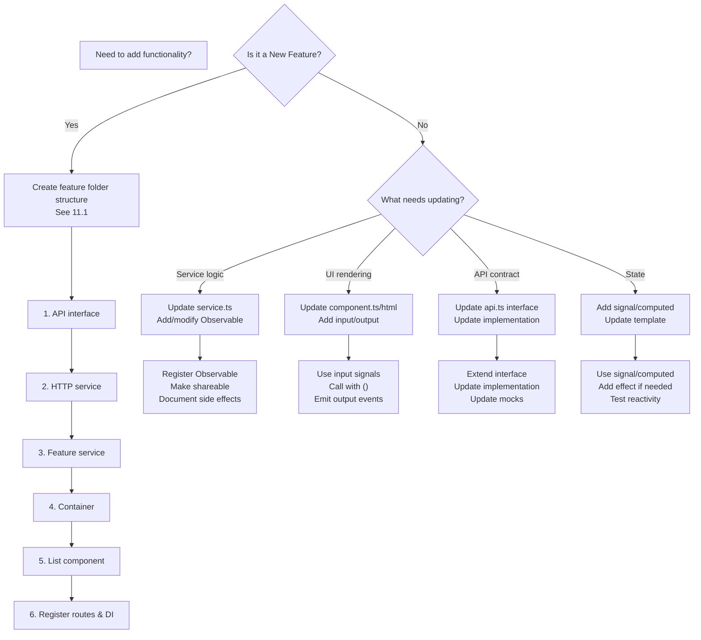

---

## 13. Performance Patterns

### 13.1 Observable Sharing

```typescript
// ❌ WRONG - Creates new subscription each time
readonly mailboxes$ = this.api.getMailboxes();

// ✅ RIGHT - Share result, prevent multiple requests
readonly mailboxes$ = this.api.getMailboxes().pipe(
  shareReplay(1)  // Replay to new subscribers
);
```

### 13.2 Single Mode Accordion Performance

```typescript
// ❌ WRONG - O(n) complexity, close all then open new
items.forEach((item, idx) => {
  if (idx !== selectedIndex) item.opened = false;
});

// ✅ RIGHT - O(1) complexity, only update necessary items
if (lastOpenedIndex !== null && lastOpenedIndex !== selectedIndex) {
  this.items.get(lastOpenedIndex)?.openedChange.emit(false);
}
lastOpenedIndex = selectedIndex;
```

### 13.3 Signal Subscriptions

```typescript
// ❌ WRONG - Manual subscription without cleanup
this.service$.subscribe(data => this.process(data));

// ✅ RIGHT - Signal with automatic cleanup
readonly data = toSignal(this.service$, { initialValue: [] });
effect(() => this.process(this.data()));  // Auto cleanup on destroy
```

---

## 14. Testing Patterns

### 14.1 Container Testing

```typescript
it('should load mailboxes on init', () => {
  // Arrange
  const mockMailboxes: Mailbox[] = [{ id: 1, label: 'Inbox' }];
  spyOn(service, 'mailboxes$').and.returnValue(of(mockMailboxes));
  
  // Act
  const component = TestBed.createComponent(MailboxContainer);
  
  // Assert
  expect(component.mailboxes()).toEqual(mockMailboxes);
});
```

### 14.2 Component Testing

```typescript
it('should emit selectMailbox on selection', () => {
  // Arrange
  const mailbox: Mailbox = { id: 1, label: 'Inbox' };
  spyOn(component.selectMailbox, 'emit');
  
  // Act
  component.onSelectionChange([mailbox]);
  
  // Assert
  expect(component.selectMailbox.emit).toHaveBeenCalledWith(1);
});
```

---

## 15. Deployment Architecture

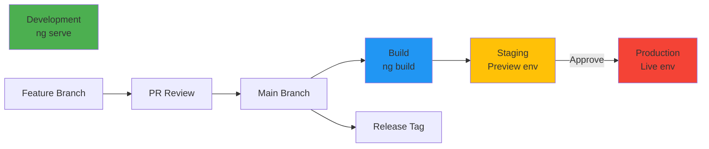

---

## Quick Reference

### Key Files to Know
- `app.config.ts` - DI container & providers
- `app.routes.ts` - Route definitions
- `core/core.providers.ts` - HTTP setup
- `features/[feature]/[feature].routes.ts` - Feature routes
- `features/[feature]/services/` - Business logic
- `features/[feature]/api/` - API contracts

### Common Commands
```bash
# Serve locally
ng serve

# Build for production
ng build --prod

# Run linter
npx eslint src/**/*.{ts,html}

# Run tests
ng test
```

### Architecture Principles
1. **Single Responsibility** - Each service has one reason to change
2. **Dependency Injection** - Inject dependencies via constructor
3. **Reactive** - Use Observables/Signals for state
4. **Composable** - Build features from reusable components
5. **Testable** - Separate concerns, mockable APIs
6. **Performance** - Cache with shareReplay(), use OnPush detection

---

## Glossary

| Term | Meaning |
|------|---------|
| **Container** | Smart component managing state |
| **Page** | Route-level component |
| **Component** | Presentational, reusable UI |
| **Service** | Business logic layer |
| **API** | HTTP contract/interface |
| **Token** | DI injection identifier |
| **Observable** | Async data stream (RxJS) |
| **Signal** | New Angular state primitive |
| **toSignal** | Convert Observable → Signal |
| **effect()** | Auto-running side effect |
| **computed()** | Derived reactive value |
| **input** | Component input signal |
| **output** | Component event emitter |

---

**Document Version:** 1.0  
**Last Updated:** 2026-03-08  
**Architecture:** Angular 17+ with Signals, Modern Standalone Components  
**Status:** Active Project Pattern

