# Mailroom UI - Workflows & How To Guide

> **Simple Architecture Guide** - Understand the workflow, know what to do next, be the team player.

---

## Table of Contents

1. [The Big Picture](#1-the-big-picture)
2. [Feature Folder Structure](#2-feature-folder-structure)
3. [App Routes Flow](#3-app-routes-flow)
4. [Data Workflow: From User to Backend](#4-data-workflow-from-user-to-backend)
5. [Building a New Feature](#5-building-a-new-feature)
6. [Component Patterns](#6-component-patterns)
7. [Common Tasks Checklist](#7-common-tasks-checklist)

---

## 1. The Big Picture

### How does data flow in this app?

```
┌──────────────┐
│   User       │
│   Clicks     │
└───────┬──────┘
        │
        ▼
┌──────────────────────┐
│   Component          │
│   (emits event)      │
└───────┬──────────────┘
        │
        ▼
┌──────────────────────┐
│   Container/Service  │
│   (converts state)   │
└───────┬──────────────┘
        │
        ▼
┌──────────────────────┐
│   API Service        │
│   (HTTP request)     │
└───────┬──────────────┘
        │
        ▼
┌──────────────────────┐
│   Backend API        │
│   (returns data)     │
└───────┬──────────────┘
        │
        ▼
┌──────────────────────┐
│   Service            │
│   (transforms data)  │
└───────┬──────────────┘
        │
        ▼
┌──────────────────────┐
│   Container          │
│   (stores in Signal) │
└───────┬──────────────┘
        │
        ▼
┌──────────────────────┐
│   Component          │
│   (renders UI)       │
└──────────────────────┘
```

**That's it. Everything else is details.**

---

## 2. Feature Folder Structure

### Every feature looks like this:

```
src/app/features/mailboxes/
│
├── mailboxes.routes.ts          ← Routes for this feature
│
├── api/
│   ├── mailbox-api.ts           ← Interface (what methods we need)
│   ├── mailbox-api.token.ts     ← How we inject it
│   └── mailbox-api.http.service.ts ← Actual HTTP requests
│
├── services/
│   └── mailbox.service.ts       ← Business logic
│
├── models/
│   └── mailbox.model.ts         ← TypeScript interfaces
│
├── mocks/
│   └── mailboxes.mock.ts        ← Fake data for dev
│
├── pages/
│   └── mailbox-page/            ← The page user sees (routes here)
│       ├── mailbox-page.component.ts
│       ├── mailbox-page.component.html
│       └── mailbox-page.component.scss
│
├── containers/
│   └── mailbox/                 ← Smart component (manages state)
│       ├── mailbox.container.ts
│       ├── mailbox.container.html
│       └── mailbox.container.scss
│
└── components/
    ├── mailbox-list/            ← Dumb component (just displays)
    └── document-list/
```

### 3 Component Types:

| Type | Purpose | Example |
|------|---------|---------|
| **Page** | Entry point from route | `mailbox-page.component.ts` |
| **Container** | Manages state & logic | `mailbox.container.ts` |
| **Component** | Just displays things | `mailbox-list.component.ts` |

---

## 2. Feature Folder Structure

### Every feature looks like this:

```
src/app/features/mailboxes/
│
├── mailboxes.routes.ts          ← Routes for this feature
│
├── api/
│   ├── mailbox-api.ts           ← Interface (what methods we need)
│   ├── mailbox-api.token.ts     ← How we inject it
│   └── mailbox-api.http.service.ts ← Actual HTTP requests
│
├── services/
│   └── mailbox.service.ts       ← Business logic
│
├── models/
│   └── mailbox.model.ts         ← TypeScript interfaces
│
├── mocks/
│   └── mailboxes.mock.ts        ← Fake data for dev
│
├── pages/
│   └── mailbox-page/            ← The page user sees (routes here)
│       ├── mailbox-page.component.ts
│       ├── mailbox-page.component.html
│       └── mailbox-page.component.scss
│
├── containers/
│   └── mailbox/                 ← Smart component (manages state)
│       ├── mailbox.container.ts
│       ├── mailbox.container.html
│       └── mailbox.container.scss
│
└── components/
    ├── mailbox-list/            ← Dumb component (just displays)
    └── document-list/
```

### 3 Component Types:

| Type | Purpose | Example |
|------|---------|---------|
| **Page** | Entry point from route | `mailbox-page.component.ts` |
| **Container** | Manages state & logic | `mailbox.container.ts` |
| **Component** | Just displays things | `mailbox-list.component.ts` |

---

## 3. App Layout (AppShell)

### The Big Container

```
┌─────────────────────────────────────────┐
│  HEADER (app-header)                    │
│  - Logo, Menu Toggle, User Profile      │
├──┬────────────────────────────────────┬─┤
│  │                                    │ │
│  │  MENU (app-menu)                  │ │  MAIN CONTENT
│  │  - Mailbox Container               │ │
│  │  - Outbox Container                │ │  (router-outlet)
│  │  - AppResizer (drag to resize)     │ │
│  │                                    │ │
│  └────────────────────────────────────┴─┤
│                                        │
│  SIDEBAR (app-sidebar)                 │
│  - Tenant Selector                     │
└────────────────────────────────────────┘
```

### File Structure:

```
src/app/core/layout/
├── app-shell/
│   ├── app-shell.component.ts        ← Main layout wrapper
│   ├── app-shell.component.html      ← HTML: Header + Sidebar + Menu + Outlet
│   └── app-shell.component.scss
├── header/
│   ├── header.component.ts           ← Top bar (menu toggle)
│   ├── header.component.html
│   └── header.component.scss
├── menu/
│   ├── menu.component.ts             ← Sidebar menu
│   ├── menu.component.html           ← Switches between Mailbox/Outbox
│   ├── menu.component.scss
│   └── menu-state.service.ts         ← Manages collapsed/width state
└── sidebar/
    ├── sidebar.component.ts
    ├── sidebar.component.html
    └── sidebar.component.scss
```

### How MenuComponent Works:

```
Menu Component HTML:
  - AppResizer (drag bar to resize menu)
  - @switch on activeModuleId
    - 'inbox' → show MailboxContainer
    - 'outbox' → show OutboxContainer

MenuStateService (global state):
  - isOpen (Signal)
  - isCollapsed (Signal)
  - width (computed from state)
  - toggleCollapsed()
  - setWidth()
```

### AppShell in action:

```
1. User sees AppShell (top layout)
2. Header shows at top with menu toggle
3. Sidebar on left (tenant selector)
4. Menu on left contains active feature (Mailbox/Outbox)
5. Main content area shows router-outlet
6. User can drag menu border to resize
```

---

## 4. App Routes Flow

### Real example: User selects a mailbox

```
STEP 1: User clicks mailbox in list
            ▼
STEP 2: mailbox-list.component.ts emits:
        selectMailbox.emit(mailboxId)
            ▼
STEP 3: mailbox.container.ts receives:
        onSelectMailbox(id) {
          this.selectedId.set(id);      ← Store in Signal
          this.router.navigate([...])   ← Update URL
        }
            ▼
STEP 4: mailbox-page.component.ts sees:
        URL changed to /mailboxes/:id
            ▼
STEP 5: Resolver calls mailbox.service.ts
            ▼
STEP 6: Service calls API:
        GET /api/mailboxes/:id
            ▼
STEP 7: HTTP Interceptor adds:
        - Authorization header (from Auth service)
        - Tenant header
        - Accept-Language
            ▼
STEP 8: Request sent to Backend
            ▼
STEP 9: Backend returns data
            ▼
STEP 10: Service stores in Signal via toSignal()
            ▼
STEP 11: Container updates Template
            ▼
STEP 12: Component renders new UI
            ▼
USER SEES MAILBOX CONTENT
```

---

## 5. Building a New Feature

### Step-by-step: Add "Console" feature

#### Step 1: Create folder structure
```bash
mkdir -p src/app/features/console/{api,services,models,mocks,pages,containers,components}
```

#### Step 2: Define what data the API returns
```typescript
// models/console.model.ts
export interface ConsoleSection {
  id: string;
  label: string;
  description?: string;
}
```

#### Step 3: Define the API contract
```typescript
// api/console-api.ts
export interface ConsoleApi {
  getSections(): Observable<ConsoleSection[]>;
}
```

#### Step 4: Implement the HTTP service
```typescript
// api/console-api.http.service.ts
@Injectable()
export class ConsoleApiHttpService implements ConsoleApi {
  private http = inject(HttpClient);
  private config = inject(AppConfigService);

  getSections(): Observable<ConsoleSection[]> {
    return this.http
      .get<{ data: ConsoleSection[] }>(
        `${this.config.appConfig.apiBaseUrl}/console`
      )
      .pipe(map(res => res.data ?? []));
  }
}
```

#### Step 5: Create the service (business logic)
```typescript
// services/console.service.ts
@Injectable({ providedIn: 'root' })
export class ConsoleService {
  private api = inject(CONSOLE_API);

  readonly sections$ = this.api.getSections();
}
```

#### Step 6: Create the container (state management)
```typescript
// containers/console/console.container.ts
@Component({
  selector: 'app-console-container',
  standalone: true,
  imports: [ConsoleListComponent],
})
export class ConsoleContainer {
  private service = inject(ConsoleService);

  readonly sections = toSignal(this.service.sections$, { 
    initialValue: [] 
  });

  readonly selectedId = signal<string | null>(null);
}
```

#### Step 7: Create the list component
```typescript
// components/console-list/console-list.component.ts
@Component({
  selector: 'app-console-list',
  template: `
    <app-ui-list 
      [items]="sections()" 
      (selectionChange)="onSelect($event)">
    </app-ui-list>
  `,
  standalone: true,
})
export class ConsoleListComponent {
  sections = input.required<ConsoleSection[]>();
  selectSection = output<string>();

  onSelect(items: ConsoleSection[]) {
    this.selectSection.emit(items[0].id);
  }
}
```

#### Step 8: Create the page
```typescript
// pages/console-page/console-page.component.ts
@Component({
  selector: 'app-console-page',
  template: `<app-console-container></app-console-container>`,
  standalone: true,
  imports: [ConsoleContainer],
})
export class ConsolePageComponent {}
```

#### Step 9: Register routes
```typescript
// console.routes.ts
export const CONSOLE_ROUTES: Routes = [
  { path: '', component: ConsolePageComponent }
];

// app.routes.ts - Add this:
{ path: 'console', children: CONSOLE_ROUTES }
```

#### Step 10: Register DI
```typescript
// app.config.ts - Add this:
{ provide: CONSOLE_API, useClass: ConsoleApiHttpService }
```

**DONE! Feature is complete.** 🎉

---

## 6. Component Patterns

### Pattern 1: Container + List (Most common)

```typescript
// CONTAINER (Smart)
@Component({...})
export class MailboxContainer {
  readonly mailboxes = toSignal(
    this.service.mailboxes$,
    { initialValue: [] }
  );
  readonly selected = signal<number | null>(null);

  onSelect(id: number) {
    this.selected.set(id);
    this.router.navigate(['/mailboxes', id]);
  }
}

// LIST COMPONENT (Dumb)
@Component({...})
export class MailboxListComponent {
  mailboxes = input.required<Mailbox[]>();
  selectMailbox = output<number>();

  onSelect(items: Mailbox[]) {
    this.selectMailbox.emit(items[0].id);
  }
}

// HTML: Container
<app-mailbox-list
  [mailboxes]="mailboxes()"
  (selectMailbox)="onSelect($event)">
</app-mailbox-list>
```

### ⚠️ Important: Always call Signals with `()`

```typescript
// ❌ WRONG
[items]="mailboxes"

// ✅ RIGHT
[items]="mailboxes()"

// ❌ WRONG
{{ selected }}

// ✅ RIGHT
{{ selected() }}
```

---

## 7. Common Tasks Checklist

### Shared UI Components Library

```
src/app/shared/ui/
├── ui-list/              ← Generic list component <T>
├── ui-accordion/         ← Accordion with items
├── ui-button/            ← Reusable button
├── ui-input/             ← Form input
├── ui-form/              ← Form container
├── ui-table/             ← Data table
├── ui-modal/             ← Modal dialog
├── ui-toast/             ← Toast notifications
├── ui-tooltip/           ← Tooltips
├── ui-tag/               ← Tag displays
├── ui-alert-banner/      ← Alert banners
├── ui-icon/              ← Icon wrapper
└── app-resizer/          ← Drag-to-resize component
```

### Shared Utilities

```
src/app/shared/
├── utils/
│   ├── layout-tokens.ts      ← All spacing & breakpoints
│   ├── breakpoint-util.service.ts  ← Responsive detection
│   └── avatar-util.service.ts      ← Avatar utilities
├── directives/               ← @Directive helpers
├── pipes/                    ← @Pipe transforms
├── models/                   ← Shared types
└── i18n/
    └── i18n service & translation keys
```

### Layout Tokens (Global Configuration)

```typescript
// shared/utils/layout-tokens.ts
export const LAYOUT_TOKENS = {
  breakpoints: {
    mobile: '(max-width: 599.99px)',
    tablet: '(min-width: 600px) and (max-width: 1023.99px)',
  },
  layout: {
    menu: {
      width: 280,           // Default menu width
      minWidth: 120,        // Minimum when collapsed
      maxWidth: 400,        // Maximum drag width
    },
    mailbox: {
      bundlesListWidth: {
        default: 650,
        min: 350,
        max: 600,
      },
    },
  },
};

// Usage in component:
const menuWidth = LAYOUT_TOKENS.layout.menu.width;
const isMobile = this.breakpointService.isMobile();
```

### AppResizer - Drag to Resize

```typescript
// AppResizer is a reusable draggable divider component
<app-resizer
  [size]="width()"           ← Current width
  [minSize]="120"            ← Minimum drag width
  [maxSize]="400"            ← Maximum drag width
  [orientation]="'vertical'" ← Direction (vertical/horizontal)
  (sizeChange)="width.set($event)">
</app-resizer>
```

Usage in Menu:
```html
<app-resizer
  [size]="widthSignal()"
  [minSize]="minWidth"
  [maxSize]="maxWidth"
  [orientation]="'vertical'"
  (sizeChange)="onWidthChanged($event)">
</app-resizer>
```

---

## 8. Common Tasks Checklist

### 🎯 Task: "Fix a bug in the mailbox list"

- [ ] Find the component: `src/app/features/mailboxes/components/mailbox-list/`
- [ ] Check the template: `.html` file
- [ ] Check the logic: `.ts` file
- [ ] Check styles: `.scss` file
- [ ] Test locally: `ng serve`
- [ ] Commit: `git add . && git commit -m "fix: mailbox list bug"`

### 🎨 Task: "Add a new field to display"

- [ ] Update model: `models/mailbox.model.ts`
- [ ] Update API: `api/mailbox-api.http.service.ts` (if needed)
- [ ] Update component template: `components/.../...component.html`
- [ ] Update component styling: `components/.../...component.scss`
- [ ] Test in browser

### 🚀 Task: "Create a new feature"

Follow **Section 5: Building a New Feature** step-by-step above.

### 🔧 Task: "Add a new input field"

- [ ] Add to model: `models/...model.ts`
- [ ] Add to form/component
- [ ] Add `input` in component: `myField = input.required<string>();`
- [ ] Use in template: `[value]="myField()"`
- [ ] Pass from parent: `[myField]="value()"`

### 💾 Task: "Save data via API"

- [ ] Add method to API interface: `save(data): Observable<Response>`
- [ ] Implement in HTTP service
- [ ] Call from service: `this.api.save(data)`
- [ ] Handle response: `.pipe(tap(...), catchError(...))`
- [ ] Update UI Signal after success

---

## Quick Reference

### Common Imports

```typescript
// State & Reactivity
import { signal, computed, input, output, effect } from '@angular/core';
import { toSignal } from '@angular/core/rxjs-interop';

// HTTP
import { inject } from '@angular/core';
import { HttpClient } from '@angular/common/http';

// Routing
import { Router, ActivatedRoute } from '@angular/router';

// RxJS
import { Observable, Subject, BehaviorSubject } from 'rxjs';
import { map, tap, switchMap, shareReplay } from 'rxjs/operators';
```

### Component Template Shortcuts

```html
<!-- Input Signal (remember the parentheses!) -->
[property]="signal()"

<!-- Output Event -->
(eventName)="handler($event)"

<!-- Two-way binding (rare in signals) -->
[(ngModel)]="variable"

<!-- Conditional rendering -->
@if (condition()) {
  <div>Shown when true</div>
}

<!-- Loops -->
@for (item of items()) {
  <div>{{ item.name }}</div>
}

<!-- Custom template -->
<ng-template #myTemplate let-item>
  <div>{{ item.label }}</div>
</ng-template>
```

### File Naming Convention

```
Feature files:
  mailbox.container.ts          ← Container component
  mailbox-list.component.ts     ← Regular component
  mailbox.service.ts            ← Service
  mailbox-api.http.service.ts   ← API implementation
  mailbox.model.ts              ← Types/interfaces
  mailboxes.mock.ts             ← Test data
  mailboxes.routes.ts           ← Routes
```

---

## When You're Stuck

### Question: "Where does X button belong?"
**Answer:** In the component that displays it, probably inside a method in that component.

### Question: "Where do I make the API call?"
**Answer:** In the API service. Call it from the feature service. Call the feature service from the container.

### Question: "Why isn't my list updating?"
**Answer:** You forgot to call the Signal with `()` in the template.

### Question: "How do I pass data from parent to child?"
**Answer:** Use `@Input() value = input.required<Type>();` in child, then `[value]="myValue()"` in parent template.

### Question: "How do I send data from child to parent?"
**Answer:** Use `selectItem = output<Type>();` in child, emit with `selectItem.emit(value)`, catch with `(selectItem)="handler($event)"` in parent.

### Question: "Where do I add error handling?"
**Answer:** In the service, `catchError(err => { /* handle */ })`

### Question: "How do I store user selection?"
**Answer:** `readonly selected = signal<Type | null>(null);` in container.

---

## File Locations You'll Use Often

```
To change how mailbox list displays:
  → src/app/features/mailboxes/components/mailbox-list/

To add a new field to mailbox:
  → src/app/features/mailboxes/models/mailbox.model.ts

To change what API is called:
  → src/app/features/mailboxes/api/mailbox-api.http.service.ts

To add business logic:
  → src/app/features/mailboxes/services/mailbox.service.ts

To add a new route:
  → src/app/features/mailboxes/mailboxes.routes.ts

To register new service in DI:
  → src/app/app.config.ts

To add HTTP headers globally:
  → src/app/core/interceptors/
```

---

## Your Workflow

### Day 1: Adding a Feature
1. Create folder structure (Section 5, Step 1)
2. Create model (Step 2)
3. Create API interface (Step 3)
4. Create HTTP service (Step 4)
5. Create feature service (Step 5)
6. Create container (Step 6)
7. Create list component (Step 7)

### Day 2: Testing & Polish
1. Add mock data
2. Test list displays correctly
3. Test selection works
4. Add styling
5. Test on mobile

### Day 3: Integration
1. Create page component
2. Add routes
3. Register in DI
4. Test navigation
5. Commit & push

---

## Be a Team Player 💪

**You now know:**
- ✅ Where to find things
- ✅ What each file does
- ✅ How to add features
- ✅ Common patterns
- ✅ What to do when stuck

**When assigned a task:**
- 📍 Find the right file
- 📖 Read existing similar code
- 📝 Follow the pattern
- ✔️ Test thoroughly
- 📊 Ask for review

**That's being a senior developer!** 🚀

---

**Document Version:** 2.0 (Simplified)  
**Last Updated:** 2026-03-08  
**Status:** Team-ready Guide


---

## 1. Application Layers

The application is organized in **4 distinct layers** following a clean architecture approach:

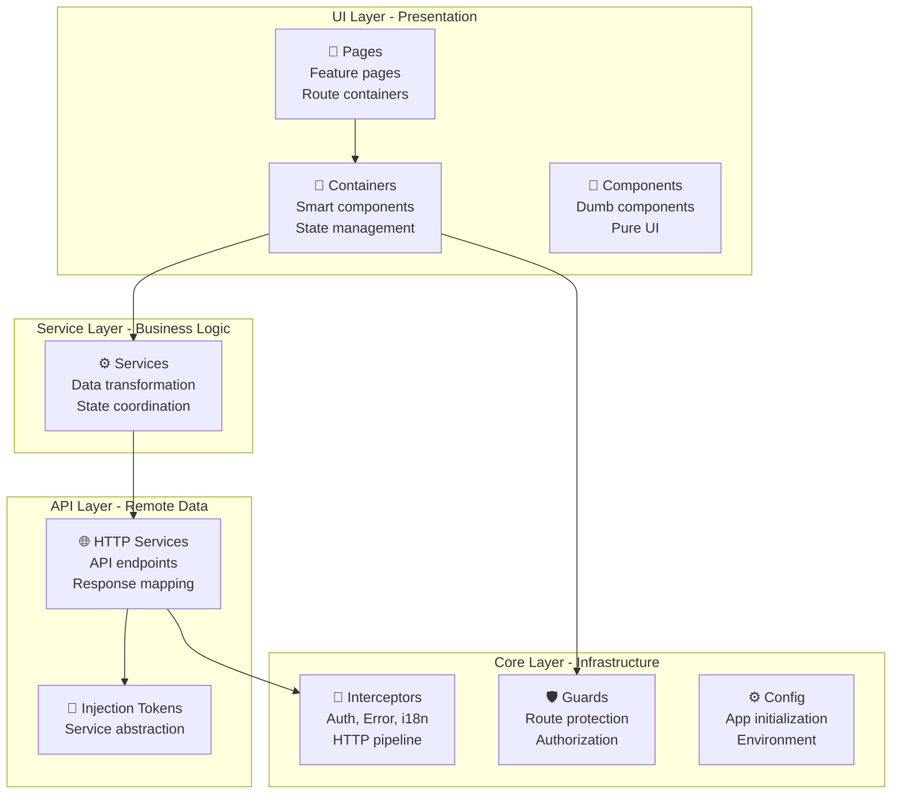

### Layer Responsibilities

| Layer | Responsibility | Examples |
|-------|---|---|
| **UI** | Render UI, emit events | Pages, Containers, Components |
| **Service** | Business logic, data transformation | MailboxService, DocumentService |
| **API** | HTTP communication, response mapping | MailboxApiHttpService |
| **Core** | Cross-cutting concerns | Auth, Error handling, Config |

---

## 2. Core Architecture

### 2.1 Application Bootstrap

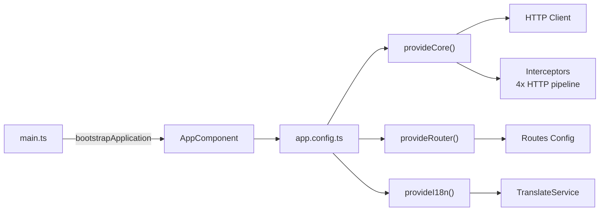

### 2.2 Dependency Injection Container

```typescript
// app.config.ts - Central DI configuration
export const appConfig: ApplicationConfig = {
  providers: [
    provideCore(),           // HTTP, Interceptors, Auth
    provideI18n(),          // Translation service
    provideAppConfig(),     // Config initialization
    provideRouter(routes),  // Routing
    
    // API Implementations (Injection Tokens)
    { provide: MAILBOX_API, useClass: MailboxApiHttpService },
    { provide: DOCUMENT_API, useClass: DocumentApiHttpService },
    { provide: VIEWER_API, useClass: ViewerApiHttpService },
    { provide: BUNDLE_API, useClass: BundleApiHttpService },
  ]
};
```

### 2.3 HTTP Interceptor Pipeline

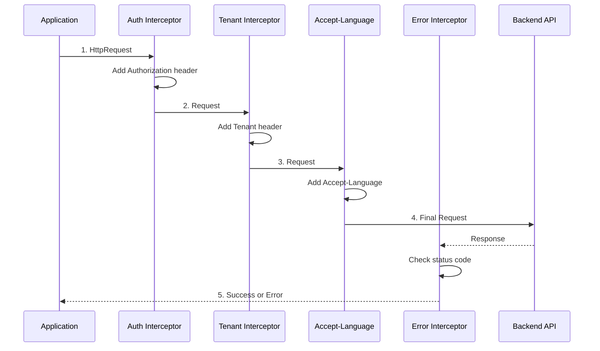

---

## 3. Feature Module Pattern

### 3.1 Feature Folder Structure

Every feature follows this **consistent structure**:

```
features/
├── mailboxes/                    # Feature module name
│   ├── mailboxes.routes.ts      # Route definitions
│   ├── api/
│   │   ├── mailbox-api.ts       # Interface (abstraction)
│   │   ├── mailbox-api.token.ts # Injection token
│   │   └── mailbox-api.http.service.ts  # Implementation
│   ├── services/
│   │   └── mailbox.service.ts   # Business logic
│   ├── models/
│   │   └── mailbox.model.ts     # TypeScript interfaces
│   ├── mocks/
│   │   └── mailboxes.mock.ts    # Dev/test data
│   ├── pages/
│   │   └── mailbox-page/
│   │       ├── mailbox-page.component.ts
│   │       ├── mailbox-page.component.html
│   │       └── mailbox-page.component.scss
│   ├── containers/
│   │   └── mailbox/
│   │       ├── mailbox.container.ts    # Smart component
│   │       ├── mailbox.container.html
│   │       └── mailbox.container.scss
│   └── components/
│       ├── mailbox-list/
│       └── document-list/
```

### 3.2 Feature Module Layers (Detailed)

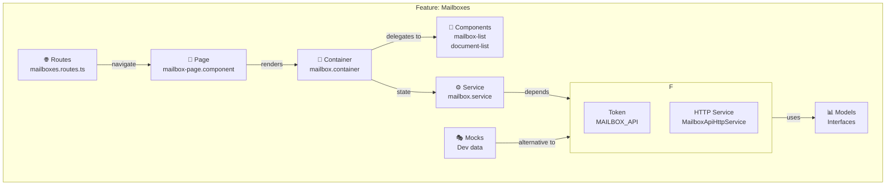

---

## 4. Data Flow Architecture

### 4.1 Master Data Flow (Request → Response)

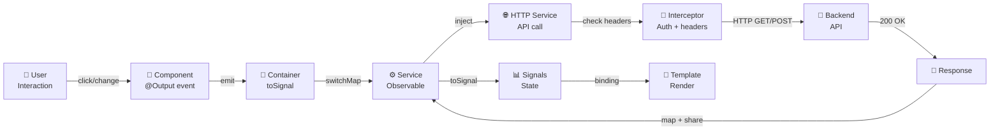

### 4.2 Real-world Example: Load Mailboxes

```typescript
// Step 1: User navigates to /mailboxes
// ↓
// Step 2: Resolver triggers mailboxResolver
// ↓
// Step 3: MailboxService initiates request
readonly mailboxes$ = this.refresh$.pipe(
  startWith(void 0),                    // Trigger immediately
  switchMap(() => this.api.getMailboxes()),  // Call API
  shareReplay(1)                        // Share result, cache
);

// Step 4: Container converts to Signal
readonly mailboxes = toSignal(
  this.mailboxService.mailboxes$.pipe(map(...)),
  { initialValue: [] }
);

// Step 5: Transform data (add avatars, initials)
map(sections => sections.map(section => ({
  ...section,
  mailboxes: section.mailboxes.map(m => ({
    ...m,
    initials: this.avatarUtils.getInitials(m.label),
    avatarClass: this.avatarUtils.getAvatarClass(m.label)
  }))
})))

// Step 6: Pass to component as input Signal
[sections]="mailboxes()"    // Call signal to get value

// Step 7: Component renders with UiListComponent
<app-ui-list [items]="sections()" (selectionChange)="onSelectionChange($event)">
```

---

## 5. Component Architecture

### 5.1 Component Type Hierarchy

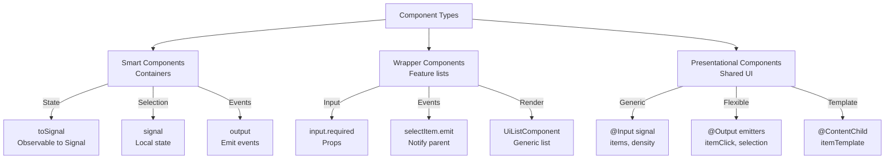

### 5.2 Input/Output Pattern (Modern)

```typescript
// ✅ NEW: Signals API (Angular 17+)
@Component({...})
export class MailboxListComponent {
  // Input as Signal
  mailboxes = input.required<Mailbox[]>();
  selectedMailboxId = input<number | null>(null);
  
  // Computed derived state
  selectedMailbox = computed(() => {
    const id = this.selectedMailboxId();
    if (!id) return null;
    return this.mailboxes()?.find(m => m.id === id) ?? null;
  });
  
  // Output for events
  selectMailbox = output<number>();
  
  onSelectionChange(items: Mailbox[]) {
    this.selectMailbox.emit(items[0].id);
  }
}

// Template usage
[mailboxes]="mailboxes()"           // ✅ Call signal
[selectedMailboxId]="selectedId()"  // ✅ Call signal
(selectMailbox)="onSelect($event)"  // ✅ Event listener
```

### 5.3 Generic Reusable Component: UiListComponent

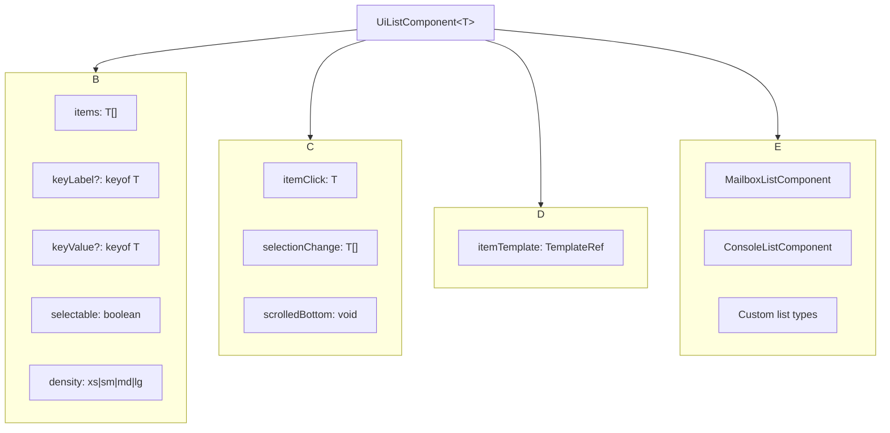

---

## 6. Routing Architecture

### 6.1 Route Hierarchy

```
/
├── /select-tenant              ← Tenant selection
├── /                           ← Home (canActivate: tenantGuard)
│   ├── /mailboxes              ← Mailbox list
│   ├── /mailboxes/:id          ← Specific mailbox
│   ├── /outbox                 ← Outbox feature
│   └── /console                ← Console feature
└── /tenant-selector            ← Admin tenant selector
```

### 6.2 Route Resolution & Guards

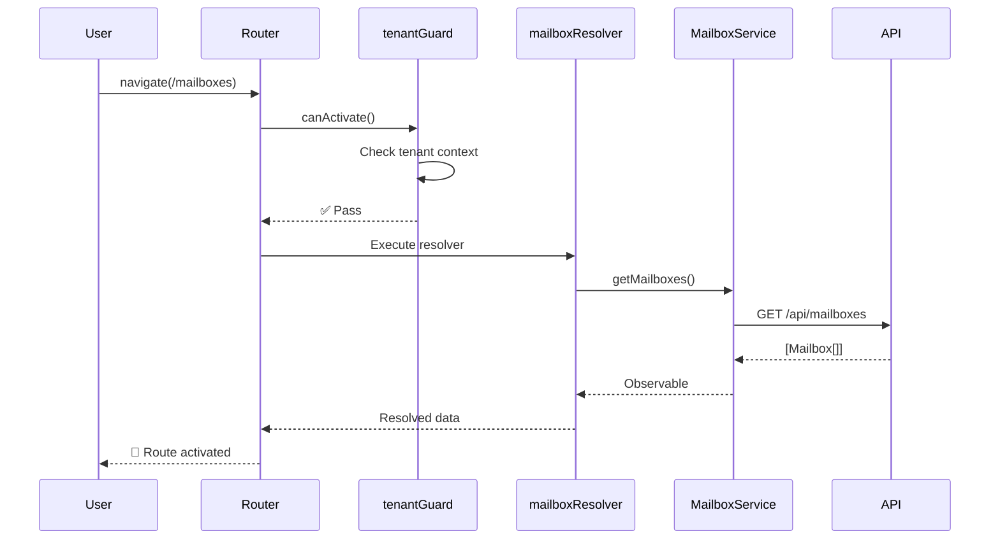

### 6.3 Lazy Load with MAILBOX_ROUTES

```typescript
// app.routes.ts - Main router configuration
export const routes: Routes = [
  {
    path: 'mailboxes',
    component: MailboxPageComponent,
    resolve: { mailboxes: mailboxResolver },  // Pre-load data
  },
  {
    path: 'mailboxes/:mailboxId',
    component: MailboxPageComponent,
    resolve: { mailboxes: mailboxResolver },
  },
];

// mailboxes.routes.ts - Feature routes
export const MAILBOX_ROUTES: Routes = [
  {
    path: '',
    pathMatch: 'full',
    redirectTo: 'mailboxes',
  },
  ...
];
```

---

## 7. State Management

### 7.1 State Management Strategy

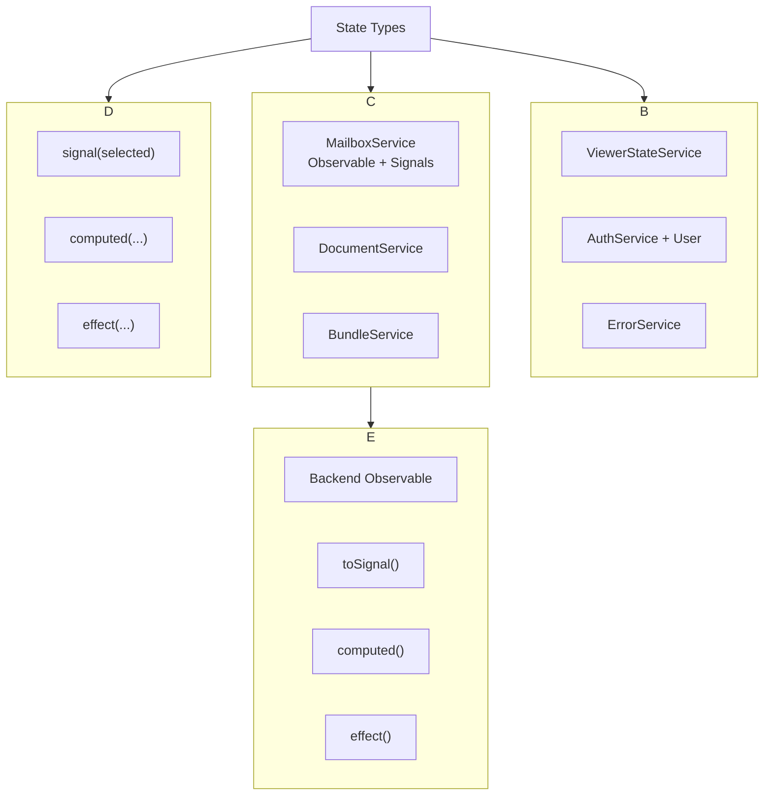

### 7.2 Signal-based State (Modern Example)

```typescript
// MailboxService - Feature state management
@Injectable({ providedIn: 'root' })
export class MailboxService {
  private readonly api = inject(MAILBOX_API);
  
  // Signals for state
  private readonly searchQuerySignal = signal('');
  private readonly hasMoreSearchResultsSignal = signal(true);
  readonly loading = signal(true);
  
  // Subjects for actions
  private readonly refresh$ = new Subject<void>();
  private readonly searchInput$ = new Subject<MailboxSearch>();
  
  // Observable state (from API)
  readonly mailboxes$ = this.refresh$.pipe(
    startWith(void 0),
    switchMap(() => this.api.getMailboxes()),
    shareReplay(1)  // Cache result
  );
  
  // Derived signals
  readonly hasSearchResults = computed(() => 
    this.searchQuerySignal().length > 0
  );
}

// Container - Convert Observable to Signal
export class MailboxContainer {
  readonly mailboxes = toSignal(
    this.mailboxService.mailboxes$.pipe(map(...)),
    { initialValue: [] }
  );
  
  readonly selectedMailboxId = signal<number | null>(null);
  
  selectMailbox(id: number) {
    this.selectedMailboxId.set(id);
  }
}
```

### 7.3 When to Use Signal vs Observable

| Use Case | Pattern | Example |
|----------|---------|---------|
| **Local state** | `signal()` | `selectedId = signal(null)` |
| **Derived state** | `computed()` | `computed(selectedMailbox)` |
| **Effect** | `effect()` | `effect(() => router.navigate(...))` |
| **API response** | `Observable` | `this.api.getMailboxes()` |
| **Convert to signal** | `toSignal()` | `toSignal(observable$)` |
| **Subscription cleanup** | `takeUntilDestroyed()` | Automatic cleanup |

---

## 8. Service Patterns

### 8.1 API Service Pattern (Token + Implementation)

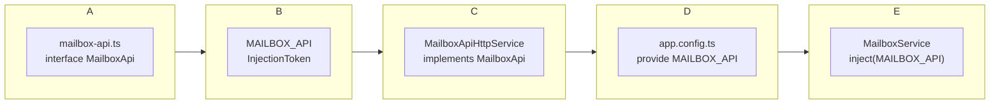

```typescript
// 1️⃣ Abstraction - mailbox-api.ts
export interface MailboxApi {
  getMailboxes(): Observable<MailboxSection[]>;
  getMailboxById(id: number): Observable<Mailbox>;
  searchMailbox(query: string): Observable<MailboxSearch[]>;
}

// 2️⃣ Token - mailbox-api.token.ts
export const MAILBOX_API = new InjectionToken<MailboxApi>('MAILBOX_API');

// 3️⃣ Implementation - mailbox-api.http.service.ts
@Injectable()
export class MailboxApiHttpService implements MailboxApi {
  private readonly http = inject(HttpClient);
  private readonly config = inject(AppConfigService);
  
  getMailboxes(): Observable<MailboxSection[]> {
    return this.http
      .get<MailboxResponse>(`${this.config.appConfig.apiBaseUrl}/mailboxes`)
      .pipe(map(res => res.data ?? []));
  }
}

// 4️⃣ Registration - app.config.ts
{ provide: MAILBOX_API, useClass: MailboxApiHttpService }

// 5️⃣ Usage - mailbox.service.ts
export class MailboxService {
  private readonly api = inject(MAILBOX_API);  // Get from DI
  
  readonly mailboxes$ = this.api.getMailboxes();
}
```

### 8.2 Service Responsibilities

```
MailboxService (⚙️ Business Logic)
├── Coordinate API calls
├── Manage feature state (Signals + Observables)
├── Transform data
├── Handle search/pagination
└── Expose Observables for components

MailboxApiHttpService (🌐 HTTP)
├── Make HTTP requests
├── Map API responses
├── Apply HttpParams
└── Handle URL building

MailboxContainer (🎯 Smart Component)
├── Subscribe to service
├── Convert Observable → Signal
├── Handle user interactions
└── Navigate/update URL
```

---

## 9. Shared UI Components

### 9.1 Component Library Architecture

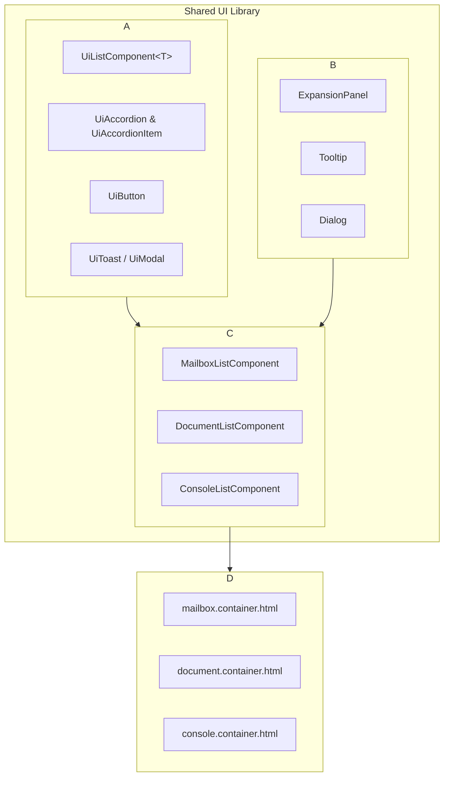

### 9.2 Generic List Pattern

**UiListComponent** is the **core reusable component** for all list rendering:

```typescript
// Generic signature
@Component({...})
export class UiListComponent<T> {
  items = input.required<T[]>();
  keyLabel = input<keyof T | null>(null);      // Which field to display
  keyValue = input<keyof T | null>(null);      // Unique identifier
  selectable = input(false);                    // Enable selection
  multiSelect = input(false);                   // Multiple selection
  
  itemClick = output<T>();
  selectionChange = output<T[]>();
  scrolledBottom = output<void>();
  
  itemTemplate = contentChild(...);             // Custom render template
}
```

**Feature-specific wrappers** adapt UiListComponent:

```typescript
// MailboxListComponent - Wraps UiListComponent for mailboxes
@Component({
  selector: 'app-mailbox-list',
  template: `
    <app-ui-list
      [items]="mailboxes()"
      [selectedItem]="selectedMailbox()"
      (selectionChange)="onSelectionChange($event)">
      <ng-template #itemTemplate let-mailbox>
        <div>{{ mailbox.label }}</div>
        <span class="unread">{{ getUnreadLabel(mailbox.unreadCount) }}</span>
      </ng-template>
    </app-ui-list>
  `
})
export class MailboxListComponent {
  mailboxes = input.required<Mailbox[]>();
  selectMailbox = output<number>();
  
  onSelectionChange(items: Mailbox[]) {
    this.selectMailbox.emit(items[0].id);
  }
}
```

---

## 10. Feature Workflows

### 10.1 Complete Feature Workflow: Load & Display Mailboxes

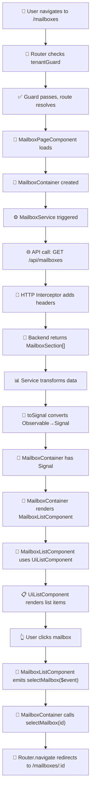

### 10.2 Accordion Component Workflow (Single Mode)

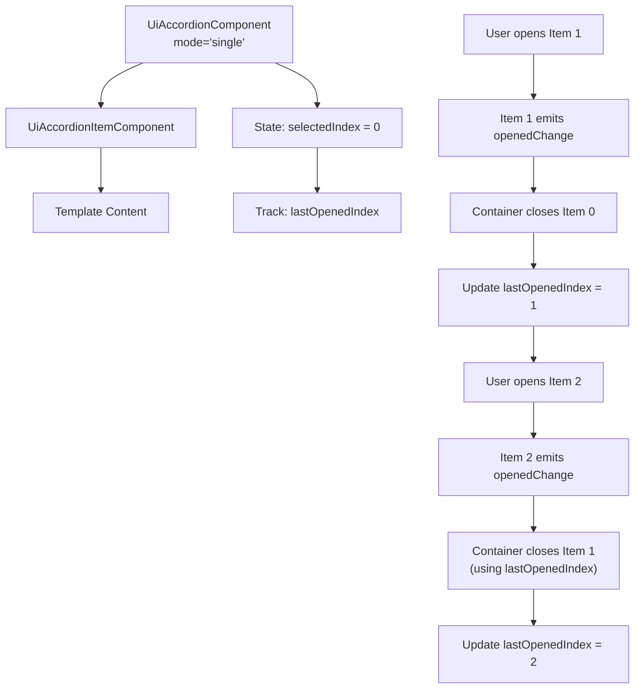

### 10.3 Document Viewing Workflow

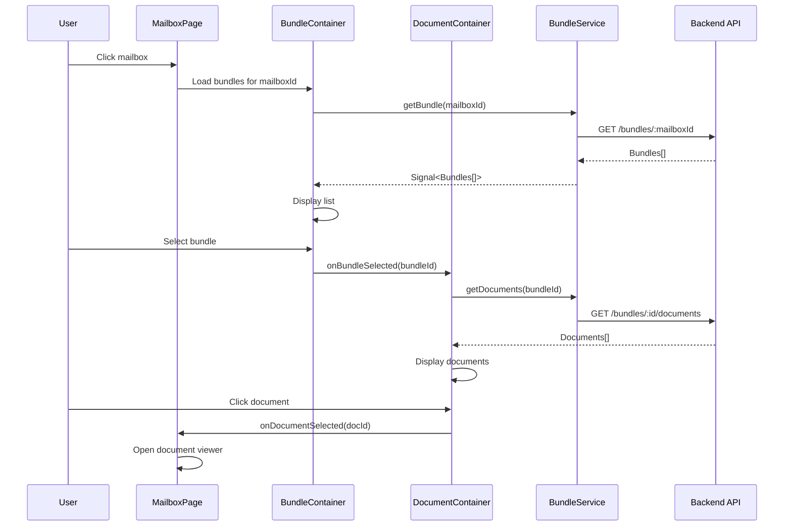

---

## 11. Development Workflow Best Practices

### 11.1 Creating a New Feature

#### Step 1: Setup Feature Structure
```bash
features/myfeature/
├── myfeature.routes.ts
├── api/
│   ├── myfeature-api.ts           # Interface
│   ├── myfeature-api.token.ts     # Token
│   └── myfeature-api.http.service.ts  # Implementation
├── services/
│   └── myfeature.service.ts       # Business logic
├── models/
│   └── myfeature.model.ts
├── pages/
│   └── myfeature-page/
├── containers/
│   └── myfeature/
└── components/
    └── myfeature-list/
```

#### Step 2: Define API Contract

```typescript
// myfeature-api.ts (Abstraction)
export interface MyFeatureApi {
  getItems(): Observable<MyFeatureItem[]>;
  getItem(id: string): Observable<MyFeatureItem>;
}
```

#### Step 3: Implement API Service

```typescript
// myfeature-api.http.service.ts
@Injectable()
export class MyFeatureApiHttpService implements MyFeatureApi {
  private readonly http = inject(HttpClient);
  private readonly config = inject(AppConfigService);

  getItems(): Observable<MyFeatureItem[]> {
    return this.http
      .get<ApiResponse<MyFeatureItem[]>>(
        `${this.config.appConfig.apiBaseUrl}/items`
      )
      .pipe(map(res => res.data ?? []));
  }
}
```

#### Step 4: Create Feature Service

```typescript
// myfeature.service.ts
@Injectable({ providedIn: 'root' })
export class MyFeatureService {
  private readonly api = inject(MYFEATURE_API);
  
  readonly items$ = this.api.getItems().pipe(shareReplay(1));
}
```

#### Step 5: Create Container Component

```typescript
// containers/myfeature/myfeature.container.ts
@Component({
  selector: 'app-myfeature-container',
  template: `<app-myfeature-list [items]="items()"></app-myfeature-list>`,
  standalone: true,
  imports: [CommonModule, MyFeatureListComponent],
})
export class MyFeatureContainer {
  private readonly service = inject(MyFeatureService);
  
  readonly items = toSignal(this.service.items$, { initialValue: [] });
}
```

#### Step 6: Create Feature List Component

```typescript
// components/myfeature-list/myfeature-list.component.ts
@Component({
  selector: 'app-myfeature-list',
  template: `
    <app-ui-list [items]="items()" (selectionChange)="onSelect($event)">
      <ng-template #itemTemplate let-item>
        <!-- Custom render -->
      </ng-template>
    </app-ui-list>
  `,
  standalone: true,
})
export class MyFeatureListComponent {
  items = input.required<MyFeatureItem[]>();
  selectItem = output<MyFeatureItem>();
  
  onSelect(items: MyFeatureItem[]) {
    this.selectItem.emit(items[0]);
  }
}
```

#### Step 7: Register Routes & DI

```typescript
// app.routes.ts
{ path: 'myfeature', component: MyFeaturePageComponent }

// app.config.ts
{ provide: MYFEATURE_API, useClass: MyFeatureApiHttpService }
```

### 11.2 Common Gotchas

| Problem | Solution |
|---------|----------|
| **Signal not updating in template** | Call signal with `()`: `[items]="items()"` |
| **Can't style template in container** | Add `ViewEncapsulation.None` to component |
| **Memory leaks from subscriptions** | Use `takeUntilDestroyed()` or `toSignal()` |
| **Type errors with computed/input** | Always invoke with `()` in template |
| **Form not resetting** | Use `markAllAsTouched()` and proper Signal updates |
| **Accordion single mode closing multiple** | Track `lastOpenedIndex` and only close that one |

---

## 12. Workflow Decision Tree

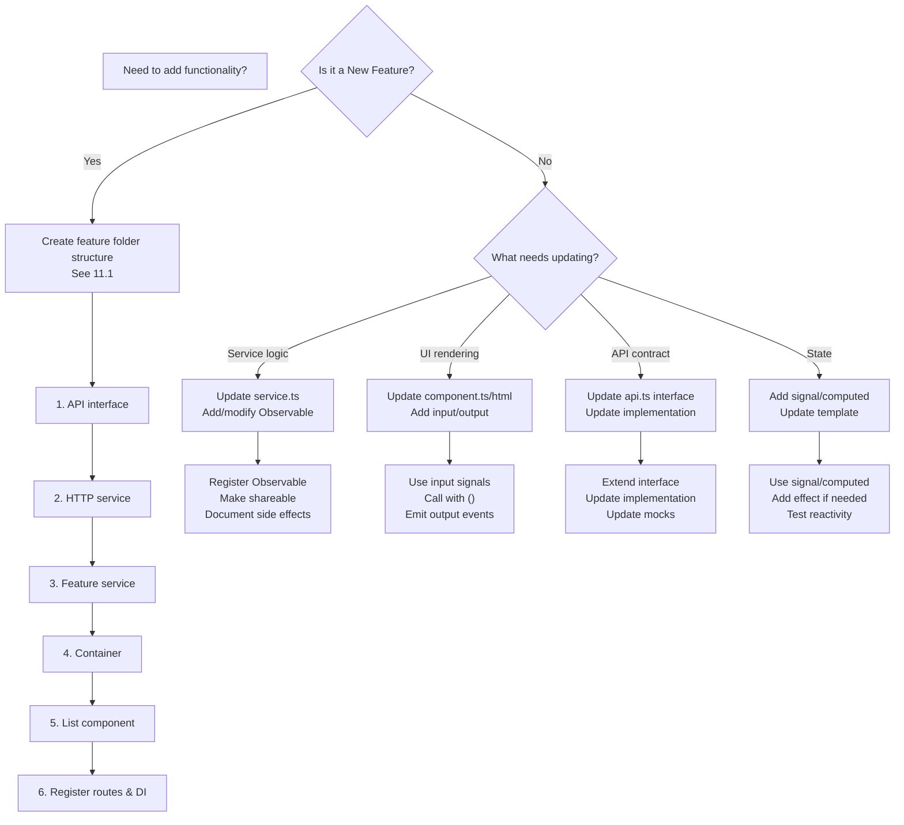

---

## 13. Performance Patterns

### 13.1 Observable Sharing

```typescript
// ❌ WRONG - Creates new subscription each time
readonly mailboxes$ = this.api.getMailboxes();

// ✅ RIGHT - Share result, prevent multiple requests
readonly mailboxes$ = this.api.getMailboxes().pipe(
  shareReplay(1)  // Replay to new subscribers
);
```

### 13.2 Single Mode Accordion Performance

```typescript
// ❌ WRONG - O(n) complexity, close all then open new
items.forEach((item, idx) => {
  if (idx !== selectedIndex) item.opened = false;
});

// ✅ RIGHT - O(1) complexity, only update necessary items
if (lastOpenedIndex !== null && lastOpenedIndex !== selectedIndex) {
  this.items.get(lastOpenedIndex)?.openedChange.emit(false);
}
lastOpenedIndex = selectedIndex;
```

### 13.3 Signal Subscriptions

```typescript
// ❌ WRONG - Manual subscription without cleanup
this.service$.subscribe(data => this.process(data));

// ✅ RIGHT - Signal with automatic cleanup
readonly data = toSignal(this.service$, { initialValue: [] });
effect(() => this.process(this.data()));  // Auto cleanup on destroy
```

---

## 14. Testing Patterns

### 14.1 Container Testing

```typescript
it('should load mailboxes on init', () => {
  // Arrange
  const mockMailboxes: Mailbox[] = [{ id: 1, label: 'Inbox' }];
  spyOn(service, 'mailboxes$').and.returnValue(of(mockMailboxes));
  
  // Act
  const component = TestBed.createComponent(MailboxContainer);
  
  // Assert
  expect(component.mailboxes()).toEqual(mockMailboxes);
});
```

### 14.2 Component Testing

```typescript
it('should emit selectMailbox on selection', () => {
  // Arrange
  const mailbox: Mailbox = { id: 1, label: 'Inbox' };
  spyOn(component.selectMailbox, 'emit');
  
  // Act
  component.onSelectionChange([mailbox]);
  
  // Assert
  expect(component.selectMailbox.emit).toHaveBeenCalledWith(1);
});
```

---

## 15. Deployment Architecture

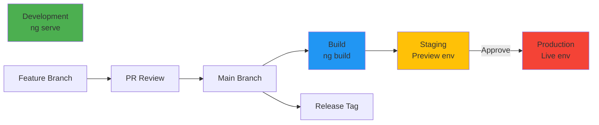

---

## Quick Reference

### Key Files to Know
- `app.config.ts` - DI container & providers
- `app.routes.ts` - Route definitions
- `core/core.providers.ts` - HTTP setup
- `features/[feature]/[feature].routes.ts` - Feature routes
- `features/[feature]/services/` - Business logic
- `features/[feature]/api/` - API contracts

### Common Commands
```bash
# Serve locally
ng serve

# Build for production
ng build --prod

# Run linter
npx eslint src/**/*.{ts,html}

# Run tests
ng test
```

### Architecture Principles
1. **Single Responsibility** - Each service has one reason to change
2. **Dependency Injection** - Inject dependencies via constructor
3. **Reactive** - Use Observables/Signals for state
4. **Composable** - Build features from reusable components
5. **Testable** - Separate concerns, mockable APIs
6. **Performance** - Cache with shareReplay(), use OnPush detection

---

## Glossary

| Term | Meaning |
|------|---------|
| **Container** | Smart component managing state |
| **Page** | Route-level component |
| **Component** | Presentational, reusable UI |
| **Service** | Business logic layer |
| **API** | HTTP contract/interface |
| **Token** | DI injection identifier |
| **Observable** | Async data stream (RxJS) |
| **Signal** | New Angular state primitive |
| **toSignal** | Convert Observable → Signal |
| **effect()** | Auto-running side effect |
| **computed()** | Derived reactive value |
| **input** | Component input signal |
| **output** | Component event emitter |

---

**Document Version:** 1.0  
**Last Updated:** 2026-03-08  
**Architecture:** Angular 17+ with Signals, Modern Standalone Components  
**Status:** Active Project Pattern

