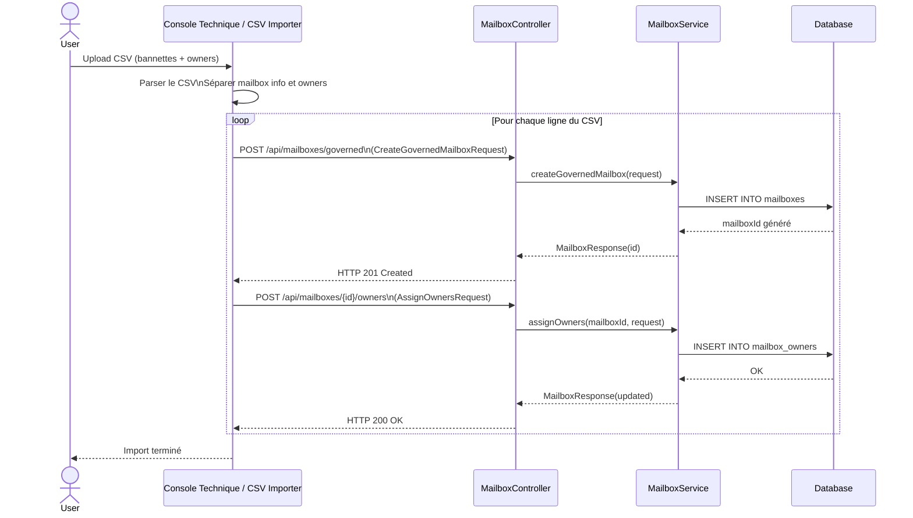

```mermaid
sequenceDiagram

actor User

participant Frontend as Console Technique / CSV Importer

participant Controller as MailboxController

participant Service as MailboxService

participant DB as Database


User->>Frontend: Upload CSV (bannettes + owners)


Frontend->>Frontend: Parser le CSV\nSéparer mailbox info et owners


loop Pour chaque ligne du CSV

Frontend->>Controller: POST /api/mailboxes/governed\n(CreateGovernedMailboxRequest)

Controller->>Service: createGovernedMailbox(request)

Service->>DB: INSERT INTO mailboxes

DB-->>Service: mailboxId généré

Service-->>Controller: MailboxResponse(id)

Controller-->>Frontend: HTTP 201 Created


Frontend->>Controller: POST /api/mailboxes/{id}/owners\n(AssignOwnersRequest)

Controller->>Service: assignOwners(mailboxId, request)

Service->>DB: INSERT INTO mailbox_owners

DB-->>Service: OK

Service-->>Controller: MailboxResponse(updated)

Controller-->>Frontend: HTTP 200 OK

end


Frontend-->>User: Import terminé
```
