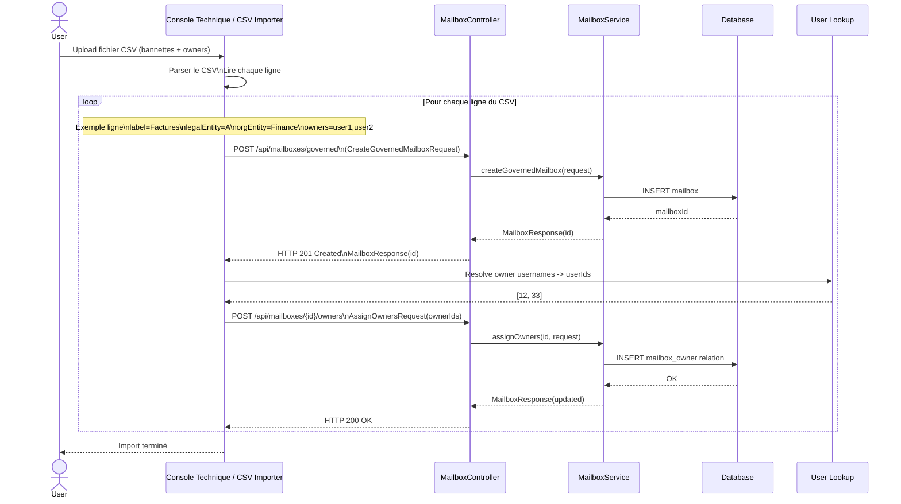

```mermaid
sequenceDiagram

actor User

participant UI as Console Technique / CSV Importer

participant Controller as MailboxController

participant Service as MailboxService

participant DB as Database

participant UserService as User Lookup


User->>UI: Upload fichier CSV (bannettes + owners)


UI->>UI: Parser le CSV\nLire chaque ligne


loop Pour chaque ligne du CSV


Note over UI: Exemple ligne\nlabel=Factures\nlegalEntity=A\norgEntity=Finance\nowners=user1,user2


UI->>Controller: POST /api/mailboxes/governed\n(CreateGovernedMailboxRequest)


Controller->>Service: createGovernedMailbox(request)


Service->>DB: INSERT mailbox


DB-->>Service: mailboxId


Service-->>Controller: MailboxResponse(id)


Controller-->>UI: HTTP 201 Created\nMailboxResponse(id)


UI->>UserService: Resolve owner usernames -> userIds


UserService-->>UI: [12, 33]


UI->>Controller: POST /api/mailboxes/{id}/owners\nAssignOwnersRequest(ownerIds)


Controller->>Service: assignOwners(id, request)


Service->>DB: INSERT mailbox_owner relation


DB-->>Service: OK


Service-->>Controller: MailboxResponse(updated)


Controller-->>UI: HTTP 200 OK


end


UI-->>User: Import terminé
```
