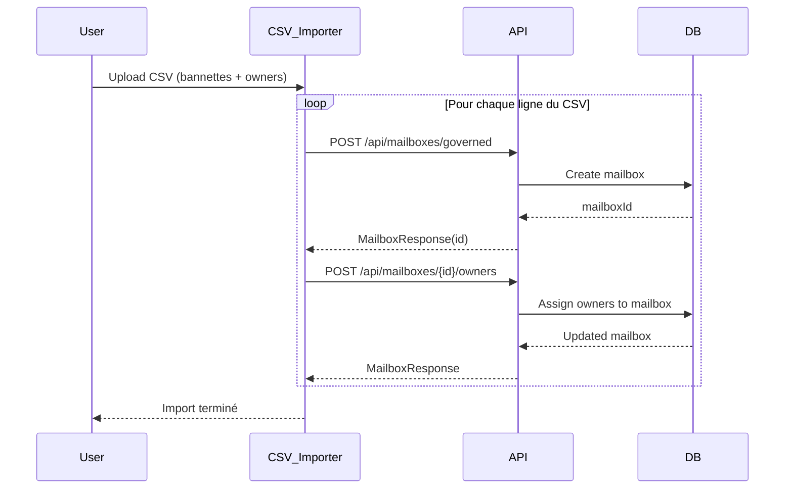

```mermaid
sequenceDiagram

participant User

participant CSV_Importer

participant API

participant DB


User->>CSV_Importer: Upload CSV (bannettes + owners)


loop Pour chaque ligne du CSV

CSV_Importer->>API: POST /api/mailboxes/governed

API->>DB: Create mailbox

DB-->>API: mailboxId

API-->>CSV_Importer: MailboxResponse(id)


CSV_Importer->>API: POST /api/mailboxes/{id}/owners

API->>DB: Assign owners to mailbox

DB-->>API: Updated mailbox

API-->>CSV_Importer: MailboxResponse

end


CSV_Importer-->>User: Import terminé
```
